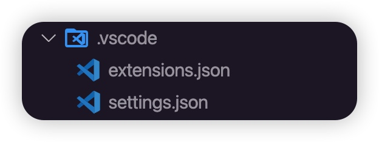
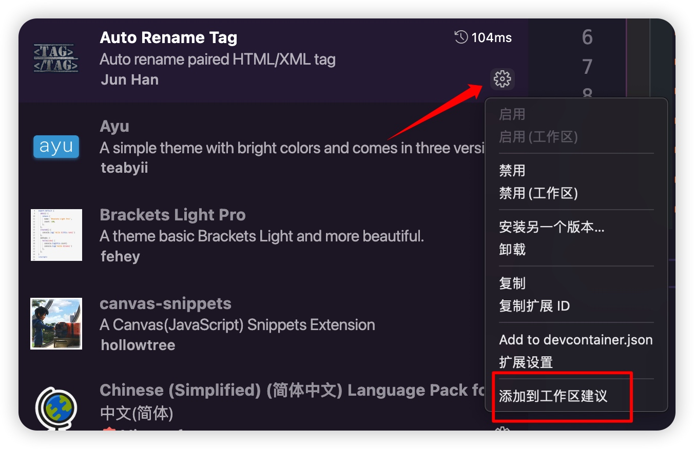
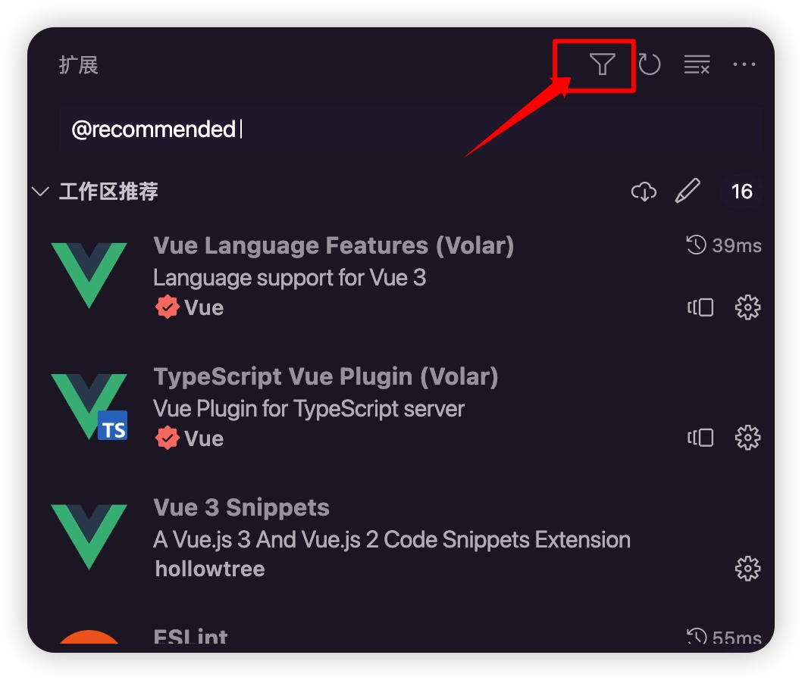
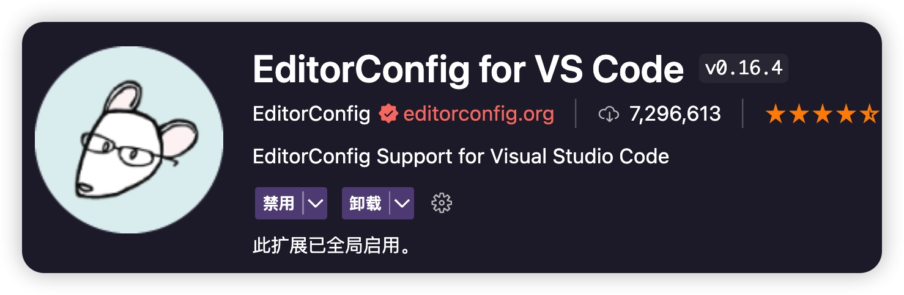

# 前端项目规范1：项目风格统一

一些刚刚毕业的同学在拿到公司的项目，或者说在git上clone下一些源代码进行学习的时候，总是被一些以前没有见过的文件和配置搞懵，这个系列文章从项目一开始说起，来聊聊我们前端项目中的一些规范

## 项目风格统一
在前端项目中存在`.vscode`文件夹，文件夹下一般存在两个文件`extensions.json`和`setting.json`。作用是保持所有开发者安装了相同的插件和相同的配置，保持开发环境一致性。


### extensions.json
在当前项目中，需要安装哪些插件。
```js
{
  "recommendations": ["Vue.volar", "Vue.vscode-typescript-vue-plugin"]
}
```
如果需要添加需要安装的插件，可以直接在插件中心里面找到对应的插件，点击`添加到工作区`即可

常用 `extensions.json` 配置
```js
{
  "recommendations": [
    "vue.volar",
    "vue.vscode-typescript-vue-plugin",
    "hollowtree.vue-snippets",
    "dbaeumer.vscode-eslint",
    "stylelint.vscode-stylelint",
    "esbenp.prettier-vscode",
    "editorconfig.editorconfig",
    "streetsidesoftware.code-spell-checker",
    "syler.sass-indented",
    "mikestead.dotenv",
    "formulahendry.auto-rename-tag",
    "dsznajder.es7-react-js-snippets",
    "vincaslt.highlight-matching-tag",
    "oderwat.indent-rainbow",
    "techer.open-in-browser",
    "ritwickdey.liveserver"
  ]
}
```
查看当前工作区推荐


### settings.json
项目统一的vscode用户设置，和vscode全局配置冲突，会覆盖全局`settings.json`配置
```js
{
  "editor.fontSize": 16,
  "editor.formatOnType": true,
  // 保存文件时自动用 prettier 格式化
  "editor.formatOnSave": true,
  "files.autoSave": "afterDelay",
  "editor.codeActionsOnSave": {
    "source.fixAll.stylelint": true
  },
  //指定哪些文件不参与搜索
  "search.exclude": {
    "**/node_modules": true,
    "**/*.log": true,
    "**/*.log*": true,
    "**/bower_components": true,
    "**/dist": true,
    "**/elehukouben": true,
    "**/.git": true,
    "**/.gitignore": true,
    "**/.svn": true,
    "**/.DS_Store": true,
    "**/.idea": true,
    "**/.vscode": false,
    "**/yarn.lock": true,
    "**/tmp": true,
    "out": true,
    "dist": true,
    "node_modules": true,
    "CHANGELOG.md": true,
    "examples": true,
    "res": true,
    "screenshots": true,
    "yarn-error.log": true,
    "**/.yarn": true
  },
  // 指定哪些文件不被 VSCode 监听，预防启动 VSCode 时扫描的文件太多，导致 CPU 占用过高
  "files.watcherExclude": {
    "**/.git/objects/**": true,
    "**/.git/subtree-cache/**": true,
    "**/.vscode/**": true,
    "**/node_modules/**": true,
    "**/tmp/**": true,
    "**/bower_components/**": true,
    "**/dist/**": true,
    "**/yarn.lock": true
  },
  "stylelint.enable": true,
  "stylelint.validate": ["css", "less", "postcss", "scss", "vue", "sass", "html"],
  "editor.tabSize": 2,
  "editor.defaultFormatter": "esbenp.prettier-vscode",
  "files.eol": "\n",
  // 配置 VScode 使用 prettier 的 formatter
  "[vue]": {
    "editor.defaultFormatter": "esbenp.prettier-vscode"
  },
  "[typescript]": {
    "editor.defaultFormatter": "esbenp.prettier-vscode"
  },
  "[json]": {
    "editor.defaultFormatter": "esbenp.prettier-vscode"
  },
  "[jsonc]": {
    "editor.defaultFormatter": "esbenp.prettier-vscode"
  },
  "[javascript]": {
    "editor.defaultFormatter": "esbenp.prettier-vscode"
  },
  "[typescriptreact]": {
    "editor.defaultFormatter": "esbenp.prettier-vscode"
  },
  "[scss]": {
    "editor.defaultFormatter": "esbenp.prettier-vscode"
  },
  "[html]": {
    "editor.defaultFormatter": "esbenp.prettier-vscode"
  },
  "[markdown]": {
    "editor.defaultFormatter": "esbenp.prettier-vscode"
  },
  "[less]": {
    "editor.defaultFormatter": "esbenp.prettier-vscode"
  },
  //拼写错误忽略
  "cSpell.words": [
    "windi",
    "browserslist",
    "tailwindcss",
    "esnext",
    "axios",
    "vuex",
    "vueuse",
    "antv",
    "tinymce",
    "qrcode",
    "sider",
    "pinia",
    "sider",
    "nprogress",
    "INTLIFY",
    "stylelint",
    "esno",
    "vitejs",
    "sortablejs",
    "mockjs",
    "codemirror",
    "iconify",
    "commitlint",
    "vditor",
    "vite",
    "echarts",
    "cropperjs",
    "logicflow",
    "zxcvbn",
    "lintstagedrc",
    "brotli",
    "tailwindcss",
    "sider",
    "pnpm",
    "antd"
  ]
}
```

## EditorConfig 配置
`EditorConfig` 帮助开发人员在 **不同的编辑器** 和 **IDE** 之间定义和维护一致的编码样式。

### 1、安装 VSCode 插件（EditorConfig ）


### 2、配置 EditorConfig（.editorconfig）
```js
# EditorConfig is awesome: https://EditorConfig.org

# top-most EditorConfig file
root = true

[*] # 表示所有文件适用
charset = utf-8 # 设置文件字符集为 utf-8
end_of_line = lf # 控制换行类型(lf | cr | crlf)
insert_final_newline = true # 始终在文件末尾插入一个新行
indent_style = space # 缩进风格（tab | space）
indent_size = 2 # 缩进大小
max_line_length = 120 # 最大行长度

[*.md] # 表示仅对 md 文件适用以下规则
max_line_length = off # 关闭最大行长度限制
trim_trailing_whitespace = false # 关闭末尾空格修剪
```

## pnpm
pnpm 是一个 JavaScript 包管理器，与 npm 和 yarn 类似，用于在项目中管理依赖项。与 npm 和 yarn 不同的是，pnpm 采用符号链接的方式来管理依赖项，以减少磁盘空间的占用和依赖项的安装时间。

**安装**

```js
npm i pnpm -g
```

**配置阿里源**
```js
pnpm config set registry https://registry.npmmirror.com
```

**常用命令**

* pnpm install: 安装项目中的所有依赖项。
* pnpm add <package>: 安装指定的依赖项，并将其添加到项目的依赖项中。
* pnpm remove <package>: 从项目中移除指定的依赖项。
* pnpm update: 更新项目中的所有依赖项。
* pnpm run <script>: 运行项目中定义的脚本。
* pnpm list: 列出项目中安装的所有依赖项。
* pnpm outdated: 列出项目中已过期的依赖项。
* pnpm info <package>: 显示指定依赖项的信息。
* pnpm search <package>: 在 npm 存储库中搜索指定的依赖项。
* pnpm audit: 对项目进行安全性检查，以查找潜在的安全漏洞。

总的来说，你不用担心又要学习一个新玩意，除了在包的安装方式上不一样，更小的安装空间，更少的错误发生，使用方式几乎和npm一模一样。

原理上，pnpm使用符号链接(软链接)和硬链接来构建`node_modules`目录。比如说，如果要下载`lodash`包，使用 `pnpm` 安装`loadsh`依赖项，`pnpm` 会先检查本地存储库中是否已经安装了`lodash`的版本。如果已经安装，则会将`lodash`的符号链接添加到项目中。如果没有安装，则会从` npm` 存储库中下载`lodash`，并将其添加到本地存储库中。这种方式可以避免在每个项目中都安装一份相同的依赖项，减少磁盘空间的占用和依赖项的安装时间。

同时，pnpm还能很好的避免**影子依赖**。比如，我们已经下载了一个依赖项。该依赖项中如果已经依赖了`lodash`，那么，如果我们使用的npm，那么我们可以直接在项目中使用`lodash`了。
你可能会疑惑，这不是一个很好的事情吗？并不是，当我们在不知情的情况下，删除或者升级了原来的依赖项，那么很有可能伴随着lodash也会被删除或者升级。这就会给我们的项目造成困扰。使用pnpm，就可以很好的排除这种情况。tes