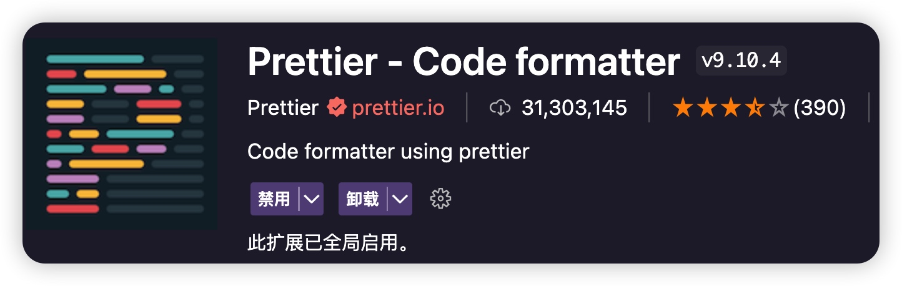
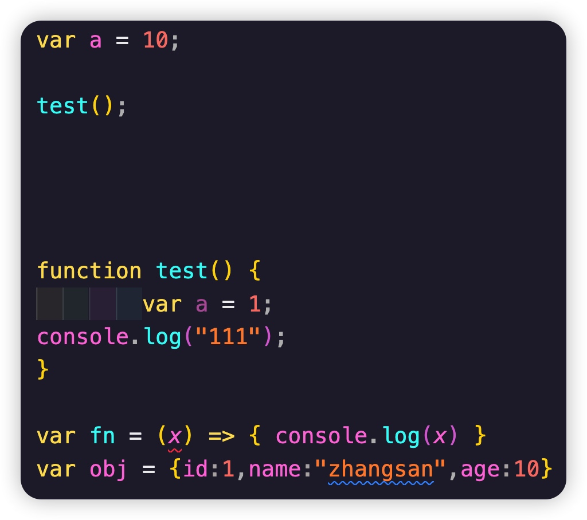
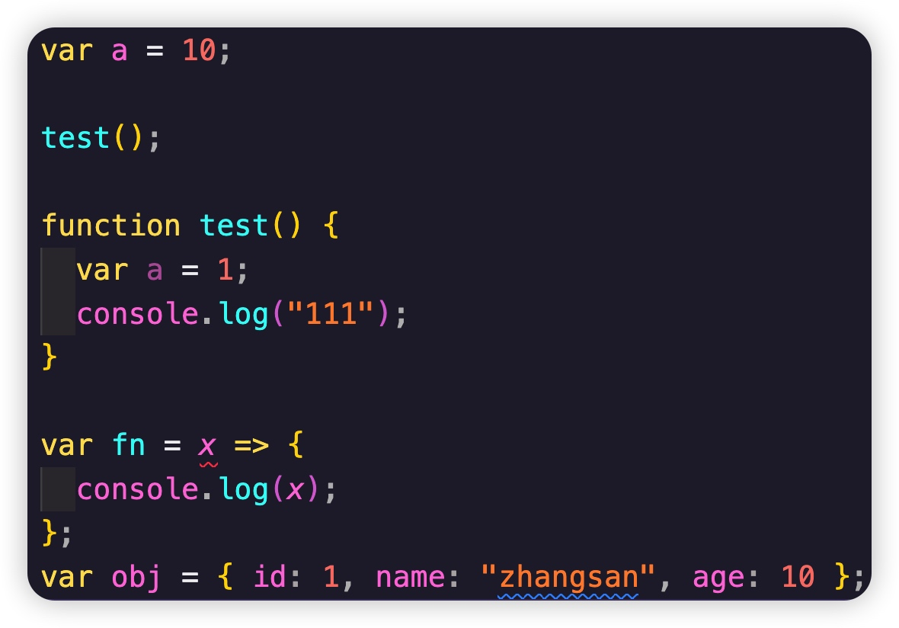
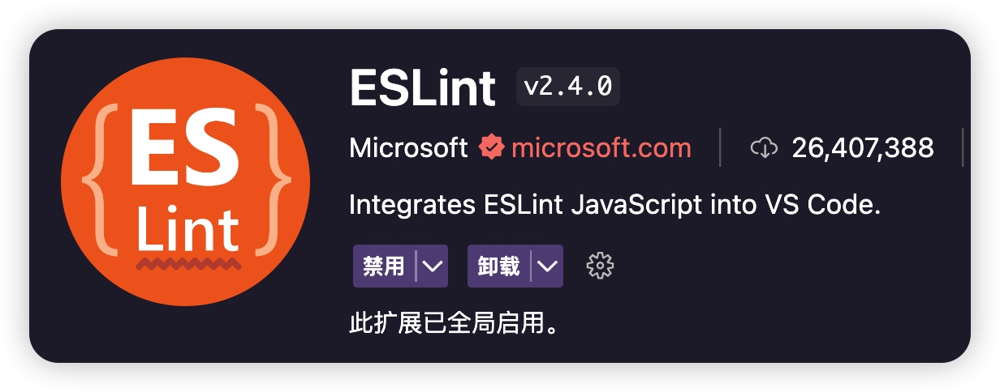
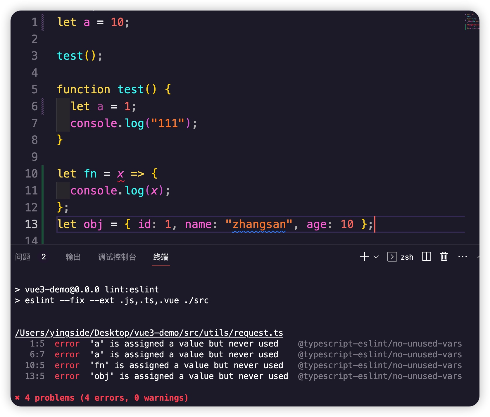

# 前端项目规范2：JS代码规范（ESLint + Prettier）

## 代码格式化配置（Prettier）

### 1、安装插件


### 2、下载 `prettier` 相关依赖
```js
pnpm add prettier -D
```

### 3、配置 Prettier（`.prettierrc.cjs`）
prettier会默认优先读取项目中的
```js
// @see: https://www.prettier.cn
module.exports = {
	// 指定最大换行长度
	printWidth: 120,
	// 缩进制表符宽度 | 空格数
	tabWidth: 2,
	// 使用制表符而不是空格缩进行 (true：制表符，false：空格)
	useTabs: false,
	// 结尾不用分号 (true：有，false：没有)
	semi: true,
	// 使用单引号 (true：单引号，false：双引号)
	singleQuote: false,
	// 在对象字面量中决定是否将属性名用引号括起来 可选值 "<as-needed|consistent|preserve>"
	quoteProps: "as-needed",
	// 在JSX中使用单引号而不是双引号 (true：单引号，false：双引号)
	jsxSingleQuote: false,
	// 多行时尽可能打印尾随逗号 可选值"<none|es5|all>"
	trailingComma: "none",
	// 在对象，数组括号与文字之间加空格 "{ foo: bar }" (true：有，false：没有)
	bracketSpacing: true,
	// 将 > 多行元素放在最后一行的末尾，而不是单独放在下一行 (true：放末尾，false：单独一行)
	bracketSameLine: false,
	// (x) => {} 箭头函数参数只有一个时是否要有小括号 (avoid：省略括号，always：不省略括号)
	arrowParens: "avoid",
	// 指定要使用的解析器，不需要写文件开头的 @prettier
	requirePragma: false,
	// 可以在文件顶部插入一个特殊标记，指定该文件已使用 Prettier 格式化
	insertPragma: false,
	// 用于控制文本是否应该被换行以及如何进行换行
	proseWrap: "preserve",
	// 在html中空格是否是敏感的 "css" - 遵守 CSS 显示属性的默认值， "strict" - 空格被认为是敏感的 ，"ignore" - 空格被认为是不敏感的
	htmlWhitespaceSensitivity: "css",
	// 控制在 Vue 单文件组件中 <script> 和 <style> 标签内的代码缩进方式
	vueIndentScriptAndStyle: false,
	// 换行符使用 lf 结尾是 可选值 "<auto|lf|crlf|cr>"
	endOfLine: "auto",
	// 这两个选项可用于格式化以给定字符偏移量（分别包括和不包括）开始和结束的代码 (rangeStart：开始，rangeEnd：结束)
	rangeStart: 0,
	rangeEnd: Infinity,
};
```
或者直接配置成mjs的形式：

```typescript
// prettier.config.mjs
/**
 * @type {import('prettier').Config}
 * @see https://www.prettier.cn/docs/options.html
 */
export default  {
	// 指定最大换行长度
	printWidth: 120,
	// 缩进制表符宽度 | 空格数
	tabWidth: 2,
	// 使用制表符而不是空格缩进行 (true：制表符，false：空格)
	useTabs: false,
	// 结尾不用分号 (true：有，false：没有)
	semi: true,
	// 使用单引号 (true：单引号，false：双引号)
	singleQuote: false,
	// 在对象字面量中决定是否将属性名用引号括起来 可选值 "<as-needed|consistent|preserve>"
	quoteProps: "as-needed",
	// 在JSX中使用单引号而不是双引号 (true：单引号，false：双引号)
	jsxSingleQuote: false,
	// 多行时尽可能打印尾随逗号 可选值"<none|es5|all>"
	trailingComma: "none",
	// 在对象，数组括号与文字之间加空格 "{ foo: bar }" (true：有，false：没有)
	bracketSpacing: true,
	// 将 > 多行元素放在最后一行的末尾，而不是单独放在下一行 (true：放末尾，false：单独一行)
	bracketSameLine: false,
	// (x) => {} 箭头函数参数只有一个时是否要有小括号 (avoid：省略括号，always：不省略括号)
	arrowParens: "avoid",
	// 指定要使用的解析器，不需要写文件开头的 @prettier
	requirePragma: false,
	// 可以在文件顶部插入一个特殊标记，指定该文件已使用 Prettier 格式化
	insertPragma: false,
	// 用于控制文本是否应该被换行以及如何进行换行
	proseWrap: "preserve",
	// 在html中空格是否是敏感的 "css" - 遵守 CSS 显示属性的默认值， "strict" - 空格被认为是敏感的 ，"ignore" - 空格被认为是不敏感的
	htmlWhitespaceSensitivity: "css",
	// 控制在 Vue 单文件组件中 <script> 和 <style> 标签内的代码缩进方式
	vueIndentScriptAndStyle: false,
	// 换行符使用 lf 结尾是 可选值 "<auto|lf|crlf|cr>"
	endOfLine: "auto",
	// 这两个选项可用于格式化以给定字符偏移量（分别包括和不包括）开始和结束的代码 (rangeStart：开始，rangeEnd：结束)
	rangeStart: 0,
	rangeEnd: Infinity,
};
```


### 4、Prettier忽略文件（.prettierignore）

```js
/dist/*
/build/*
/public/*

.local
/node_modules/**

**/*.svg
**/*.sh
```

### 5、`package.json`配置命令脚本
```js
"scripts":{
    //......其他省略
    "lint:prettier": "prettier --write \"src/**/*.{js,ts,mjs,cjs,json,tsx,css,less,scss,vue,html,md}\"",
}
```
运行命令 `pnpm run lint:prettier`,比如有如下的ts代码：

```typescript
var a = 10
test()


      function test() {
    const a = 1
  console.log(111)
	        alert("hello");
}


var fn = x => console.log(x)
var obj = {
  id: 1,
        name: 'zhangsan',
  age: 10
}
```



运行命令之后：




## 代码规范工具（ESLint）

### 1、安装插件 ESLint


`ESlint`扩展会优先去查找项目根目录中的`eslint.config.js` 配置文件，并且包括配置文件所提到的`ESlint`插件，也就是`npm`依赖包，是的没错，`ESlint`扩展本身所需的`ESlint` 版本和`ESlint`插件，都是来自于`node_modules`，你可以试着把这个目录删了，`vscode`中的`ESlint`扩展就会报错，无法运行。

但你启用`vscode`中的`ESlint`扩展之后，并不会对所有文件生效，你还需要配置`ESlint`扩展的设置来对所需的文件启用校验。

这里建议为每个项目单独添加vscode独有的设置，也就是项目根目录中创建一个`.vscode`目录，里面放置一个`settings.json`文件，这样`vscode`就会优先读取该设置：

```
// .vscode/settings.json
{
  "eslint.validate": [
    "javascript",
    "vue",
    "vue-html",
    "typescript",
    "typescriptreact",
    "html",
    "css",
    "scss",
    "less",
    "json",
    "jsonc",
    "json5",
    "markdown"
  ],
}
```

### 2、项目下载依赖

```js
pnpm i eslint eslint-config-prettier eslint-plugin-prettier eslint-plugin-vue @typescript-eslint/eslint-plugin @typescript-eslint/parser -D
```

| 依赖	| 作用描述                                                           |
|----------------------------------|--------------------------------------------------------------------|
| eslint                           | ESLint 核心库                                                      |
| eslint-config-prettier           | 关掉所有和 Prettier 冲突的 ESLint 的配置                           |
| eslint-plugin-prettier           | 将 Prettier 的 rules 以插件的形式加入到 ESLint 里面                |
| eslint-plugin-vue	               | 为 Vue 使用 ESlint 的插件                                          |
| @typescript-eslint/eslint-plugin | ESLint 插件，包含了各类定义好的检测 TypeScript 代码的规范           |
| @typescript-eslint/parser        | ESLint 的解析器，用于解析 TypeScript，从而检查和规范 TypeScript 代码 |

### 3、配置 ESLint（.eslintrc.cjs）
```js
// @see: http://eslint.cn
module.exports = {
	root: true,
	env: {
		browser: true,
		node: true,
		es6: true,
	},
	// 指定如何解析语法
	parser: "vue-eslint-parser",
	// 优先级低于 parse 的语法解析配置
	parserOptions: {
		parser: "@typescript-eslint/parser",
		ecmaVersion: 2020,
		sourceType: "module",
		jsxPragma: "React",
		ecmaFeatures: {
			jsx: true,
		},
	},
	// 继承某些已有的规则
	extends: [
		"plugin:vue/vue3-recommended",
		"plugin:@typescript-eslint/recommended",
		"plugin:prettier/recommended",
	],
	/**
	 * "off" 或 0    ==>  关闭规则
	 * "warn" 或 1   ==>  打开的规则作为警告（不影响代码执行）
	 * "error" 或 2  ==>  规则作为一个错误（代码不能执行，界面报错）
	 */
	rules: {
		// eslint (http://eslint.cn/docs/rules)
		"no-var": "error", // 要求使用 let 或 const 而不是 var
		"no-multiple-empty-lines": ["error", { max: 1 }], // 不允许多个空行
		"prefer-const": "off", // 使用 let 关键字声明但在初始分配后从未重新分配的变量，要求使用 const
		"no-use-before-define": "off", // 禁止在 函数/类/变量 定义之前使用它们
		"no-irregular-whitespace": "off", // 禁止不规则的空白

		// typeScript (https://typescript-eslint.io/rules)
		"@typescript-eslint/no-unused-vars": "error", // 禁止定义未使用的变量
		"@typescript-eslint/prefer-ts-expect-error": "error", // 禁止使用 @ts-ignore
		"@typescript-eslint/no-inferrable-types": "off", // 可以轻松推断的显式类型可能会增加不必要的冗长
		"@typescript-eslint/no-namespace": "off", // 禁止使用自定义 TypeScript 模块和命名空间。
		"@typescript-eslint/no-explicit-any": "off", // 禁止使用 any 类型
		"@typescript-eslint/ban-types": "off", // 禁止使用特定类型
		"@typescript-eslint/explicit-function-return-type": "off", // 不允许对初始化为数字、字符串或布尔值的变量或参数进行显式类型声明
		"@typescript-eslint/no-var-requires": "off", // 不允许在 import 语句中使用 require 语句
		"@typescript-eslint/no-empty-function": "off", // 禁止空函数
		"@typescript-eslint/no-use-before-define": "off", // 禁止在变量定义之前使用它们
		"@typescript-eslint/ban-ts-comment": "off", // 禁止 @ts-<directive> 使用注释或要求在指令后进行描述
		"@typescript-eslint/no-non-null-assertion": "off", // 不允许使用后缀运算符的非空断言(!)
		"@typescript-eslint/explicit-module-boundary-types": "off", // 要求导出函数和类的公共类方法的显式返回和参数类型

		// vue (https://eslint.vuejs.org/rules)
		"vue/script-setup-uses-vars": "error", // 防止<script setup>使用的变量<template>被标记为未使用，此规则仅在启用该no-unused-vars规则时有效。
		"vue/v-slot-style": "error", // 强制执行 v-slot 指令样式
		"vue/no-mutating-props": "off", // 不允许组件 prop的改变
		"vue/no-v-html": "off", // 禁止使用 v-html
		"vue/custom-event-name-casing": "off", // 为自定义事件名称强制使用特定大小写
		"vue/attributes-order": "off", // vue api使用顺序，强制执行属性顺序
		"vue/one-component-per-file": "off", // 强制每个组件都应该在自己的文件中
		"vue/html-closing-bracket-newline": "off", // 在标签的右括号之前要求或禁止换行
		"vue/max-attributes-per-line": "off", // 强制每行的最大属性数
		"vue/multiline-html-element-content-newline": "off", // 在多行元素的内容之前和之后需要换行符
		"vue/singleline-html-element-content-newline": "off", // 在单行元素的内容之前和之后需要换行符
		"vue/attribute-hyphenation": "off", // 对模板中的自定义组件强制执行属性命名样式
		"vue/require-default-prop": "off", // 此规则要求为每个 prop 为必填时，必须提供默认值
		"vue/multi-word-component-names": "off", // 要求组件名称始终为 “-” 链接的单词
	},
};
```

>**注意：** 上面的这些ESLint并不是要全部使用，我只是罗列了常见的配置，具体使用的时候请根据自己项目的情况进行配置

### 4、ESlint忽略文件(`.eslintignore`)
```js
*.sh
node_modules
*.md
*.woff
*.ttf
.vscode
.idea
dist
/public
/docs
.husky
.local
/bin
/src/mock/*
```

### 5、`package.json`配置命令脚本
```js
"scripts":{
    //......其他省略
    "lint:eslint": "eslint --fix --ext .js,.ts,.vue ./src",
}
```
运行命令 `npm run lint:eslint`,比如上面的测试代码，运行之后


## ESlint9

注意：ESlint9建议nodejs版本(`^18.18.0`, `^20.9.0`, or `>=21.1.0`)

你可以直接执行下面的命令安装并创建好配置文件：

```typescript
pnpm init @eslint/config@latest
```

不过为了说明一些问题，我们还是一步步的进行安装。

安装

```shell
pnpm add eslint@latest -D
```

命令脚本

```json
// package.json
{
  "scripts": {
    "lint": "eslint",
    "lint:fix": "eslint --fix",
  },
  "devDependencies": {
    "eslint": "^9.9.0",
  }
}
```

`eslint.config.mjs`文件

```js
//eslint.config.mjs
export default [
	// 忽略文件或者文件夹
  {
    ignores: ["node_modules", "dist", "public"]
  },
]
```

### 1、定制JavaScript规则

因为`ESlint`是默认支持解析`JavaScript`的，以及有内置一些规则，所以我们只需启用相对于的规则名称就可以了。

```js
// eslint.config.mjs
export default [
  {
    ignores: ["node_modules", "dist", "public"]
  },
	/**
   * javascript 规则
   */
  {
    rules: {
      'no-console': "error",
    }
  }
]
```

默认eslint只支持js，所以现在需要一个简单的js来测试，比如index.js

```js
var a = 10
test()
function test() {
  const a = 1
  console.log(111)
	alert("hello");
}
var fn = x => console.log(x)
var obj = { id: 1, name: 'zhangsan', age: 10 }
```

现在运行pnpm run lint就能看到eslint提示：

```text
  5:3   error  Unexpected console statement  no-console
  7:15  error  Unexpected console statement  no-console
```

当然，还有很多js规则我们可以定义，不过我们没有必要一一去定义，直接用ESlint提供的现成的规则集，要用到`@eslint/js`这个依赖包

```shell
pnpm add @eslint/js -D
```

使用：

```js
import eslint from "@eslint/js"

export default [
  {
    ignores: ["node_modules", "dist", "public"]
  },

  eslint.configs.recommended,

  /**
   * javascript 规则
   */
  {
    files: ["**/*.{js,mjs,cjs,vue}"],
    rules: {
      "no-console": "warn"
    }
  },
]
```

运行`pnpm run lint`脚本

```
  1:5   error  'a' is assigned a value but never used    no-unused-vars
  4:9   error  'a' is assigned a value but never used    no-unused-vars
  5:3   error  'alert' is not defined                    no-undef
  6:3   error  'console' is not defined                  no-undef
  6:3   error  Unexpected console statement              no-console
  8:5   error  'fn' is assigned a value but never used   no-unused-vars
  8:15  error  'console' is not defined                  no-undef
  8:15  error  Unexpected console statement              no-console
  9:5   error  'obj' is assigned a value but never used  no-unused-vars
```

为什么会提示`'console' is not defined`，这是因为`eslint.configs.recommended` 中启用了一条规则`"no-undef": "error"`，`console`是全局变量，默认就可以直接使用，对于`eslint`来说，任何变量都需要定义，不管是否全局变量。这也可避免我们在项目中使用一些真的不存在的变量时导致出现一些低级错误。

打个比方，你可以在任何浏览器环境执行`alert()`，但是你在`nodejs`环境中执行就会报错，`nodejs`中并没有该方法。

所以`eslint`一视同仁，对于任何可用的隐藏全局变量，都需要跟`eslint`打声招呼。于是，我们可以用一个依赖包来配置所有全局变量，那就是`globals`。

```
pnpm add globals -D
```

配置：

```js
import eslint from "@eslint/js"
import globals from "globals"

export default [
  {
    ignores: ["node_modules", "dist", "public"]
  },

  eslint.configs.recommended,

  /**
   * javascript 规则
   */
  {
    files: ["**/*.{js,mjs,cjs,vue}"],
    rules: {
      "no-console": "warn"
    }
  },

  /**
   * 配置全局变量
   */
  {
    languageOptions: {
      globals: {
        ...globals.browser,

        /** 追加一些其他自定义全局规则 */
        wx: true,
      },
    },
  }
]
```

现在提示报错：

```text
  1:5   error  'a' is assigned a value but never used    no-unused-vars
  4:9   error  'a' is assigned a value but never used    no-unused-vars
  6:3   error  Unexpected console statement              no-console
  8:5   error  'fn' is assigned a value but never used   no-unused-vars
  8:15  error  Unexpected console statement              no-console
  9:5   error  'obj' is assigned a value but never used  no-unused-vars
```

至少没有提示alert和console是未定义了。

当然，上面仅仅只是简单处理了brower的部分，其实我们还可以更加细分：

```typescript
{
  files: ["**/*.js", "**/*.mjs"],
  ignores: ["**/*.test.js"],
  languageOptions: {
    ecmaVersion: 2022,
    sourceType: "module",
    globals: {
      ...globals.browser,
      ...globals.node
    }
  }
},
{
  files: ["**/*.cjs"],
  languageOptions: {
    sourceType: "commonjs",
    globals: {
      ...globals.node,
      ...globals.amd
    }
  }
},
```

这样，我们在esm工程中使用module或者process等node相关api才不会报错

### 2、Vue 规则

由于`ESlint`本身只支持识别`JavaScript`，所以对于`vue`文件，还需要一个插件：`eslint-plugin-vue`，假如你的项目用的是`typescript`，那么还需要另一个解析器：`typescript-eslint`

```
pnpm add eslint-plugin-vue typescript-eslint -D
```

配置

```js
import eslint from "@eslint/js"
import globals from "globals"
import tseslint from "typescript-eslint"
import eslintPluginVue from "eslint-plugin-vue"

export default [
  {
    ignores: ["node_modules", "dist", "public"]
  },

  eslint.configs.recommended,
  ...eslintPluginVue.configs["flat/recommended"],

  /**
   * javascript 规则
   */
  {
    files: ["**/*.{js,mjs,cjs,vue}"],
    rules: {
      "no-console": "warn"
    }
  },

  /**
   * 配置全局变量
   */
  {
    files: ["**/*.js", "**/*.mjs"],
    ignores: ["**/*.test.js"],
    languageOptions: {
      ecmaVersion: 2022,
      sourceType: "module",
      globals: {
        ...globals.browser,
        ...globals.node
      }
    }
  },
  {
    files: ["**/*.cjs"],
    languageOptions: {
      sourceType: "commonjs",
      globals: {
        ...globals.node,
        ...globals.amd
      }
    }
  },

  /**
   * vue 规则
   */
  {
    files: ["**/*.vue"],
    languageOptions: {
      parserOptions: {
        /** typescript项目需要用到这个 */
        parser: tseslint.parser,
        ecmaVersion: "latest",
        /** 允许在.vue 文件中使用 JSX */
        ecmaFeatures: {
          jsx: true,
        },
      },
    },
    rules: {
      // 在这里追加 vue 规则
      "vue/no-mutating-props": [
        "error",
        {
          shallowOnly: true,
        },
      ],
    },
  },
]
```

这一步，我们使用了`eslintPluginVue.configs['flat/recommended']`作为vue的推荐规则配置。同时，里面还包含了`vue`的`ESlint`插件，用于解析`vue`文件，这也是`ESlint`配置为什么要大改的问题，因为它让`ESlint`配置更加简单了。

同时，如果是`typescript`项目，需要在`languageOptions.parserOptions`中配置解析器来支持`typescript`。

规则中的`files`属性则用于指定匹配的后缀文件或者目录用此规则或者解析器。如果不写`files`，则该规则配置对所有文件起作用。

> 这里还要注意规则的优先级问题，后面的规则会覆盖前面的规则，所以一般会把`recommended`写在最前面，然后后面再去关掉/启用一些其他规则。

对于vue的更多规则配置，你可以在[这里](https://eslint.vuejs.org/rules/)找到。

### 3、TypeScript 规则

上面我们已经安装了`typescript-eslint`用于对`vue-ts`的支持，那么它本身也是集成了`typescript`的`recommended`配置以及`ESlint`插件的，即便你不是用在`vue`项目，也可以这样使用：

```js
import eslint from "@eslint/js"
import globals from "globals"
import tseslint from "typescript-eslint"
import eslintPluginVue from "eslint-plugin-vue"

export default tseslint.config(
  {
    {
      ignores: ["node_modules", "dist", "public"]
    },
  },

  /** js推荐配置 */
  eslint.configs.recommended,
  /** ts推荐配置 */
  ...tseslint.configs.recommended,
  /** vue推荐配置 */
  ...eslintPluginVue.configs["flat/recommended"],

  /**
   * javascript 规则
   */
  {
    files: ["**/*.{js,mjs,cjs,vue}"],
    rules: {
      "no-console": "warn"
    }
  },

  /**
   * 配置全局变量
   */
  {
    files: ["**/*.js", "**/*.mjs"],
    ignores: ["**/*.test.js"],
    languageOptions: {
      ecmaVersion: 2022,
      sourceType: "module",
      globals: {
        ...globals.browser,
        ...globals.node
      }
    }
  },
  {
    files: ["**/*.cjs"],
    languageOptions: {
      sourceType: "commonjs",
      globals: {
        ...globals.node,
        ...globals.amd
      }
    }
  },

  /**
   * vue 规则
   */
  {
    files: ["**/*.vue"],
    languageOptions: {
      parserOptions: {
        /** typescript项目需要用到这个 */
        parser: tseslint.parser,
        ecmaVersion: "latest",
        /** 允许在.vue 文件中使用 JSX */
        ecmaFeatures: {
          jsx: true
        }
      }
    },
    rules: {
      // 在这里追加 vue 规则
      "vue/no-mutating-props": [
        "error",
        {
          shallowOnly: true
        }
      ]
    }
  },

  /**
   * typescript 规则
   */
  {
    files: ["**/*.{ts,tsx,vue}"],
    rules: {
    },
  },
)
```

> 注意，这里使用了`tseslint.config`这个函数，来让配置有文件有代码提示，避免写错。
>
> 当然，也可以直接使用jsdoc风格的处理
>
> ```typescript
> /** @type {import('eslint').Linter.Config[]} */
> export default [
>   ......
> ];
> ```

对于`typescript`的更多规则配置，你可以在[这里](https://typescript-eslint.io/rules/)找到。

### 4、语法风格支持

这里还推荐用`@stylistic/eslint-plugin`这个插件来提供更多的`typescript`和`JavaScript`的语法风格规则：

```
pnpm add @stylistic/eslint-plugin -D
```

配置：

```js
import eslint from "@eslint/js";
import globals from "globals";
import stylistic from "@stylistic/eslint-plugin";
import tseslint from "typescript-eslint";
import eslintPluginVue from "eslint-plugin-vue";

export default tseslint.config(
  {
    ignores: ["node_modules", "dist", "public"]
  },

  /** js推荐配置 */
  eslint.configs.recommended,
  /** ts推荐配置 */
  ...tseslint.configs.recommended,
  /** vue推荐配置 */
  ...eslintPluginVue.configs["flat/recommended"],

 stylistic.configs.customize({
    indent: 2,
    quotes: "double",
    semi: true,
    jsx: true,
    braceStyle: "1tbs",
    arrowParens: "always",
    commaDangle: "never"
  }),

  /**
   * javascript 规则
   */
  {
    files: ["**/*.{js,mjs,cjs,vue}"],
    rules: {
      "no-console": "warn"
    }
  },

  /**
   * 配置全局变量
   */
  {
    files: ["**/*.js", "**/*.mjs"],
    ignores: ["**/*.test.js"],
    languageOptions: {
      ecmaVersion: 2022,
      sourceType: "module",
      globals: {
        ...globals.browser,
        ...globals.node
      }
    }
  },
  {
    files: ["**/*.cjs"],
    languageOptions: {
      sourceType: "commonjs",
      globals: {
        ...globals.node,
        ...globals.amd
      }
    }
  },

  /**
   * vue 规则
   */
  {
    files: ["**/*.vue"],
    languageOptions: {
      parserOptions: {
        /** typescript项目需要用到这个 */
        parser: tseslint.parser,
        ecmaVersion: "latest",
        /** 允许在.vue 文件中使用 JSX */
        ecmaFeatures: {
          jsx: true
        }
      }
    },
    rules: {
      // 在这里追加 vue 规则
      "vue/no-mutating-props": [
        "error",
        {
          shallowOnly: true
        }
      ]
    }
  },

  /**
   * typescript 规则
   */
  {
    files: ["**/*.{ts,tsx,vue}"],
    rules: {
    },
  },
)
```

### 5、解决Prettier跟ESlint冲突

为了解决两者的冲突，我们要使用另一个`ESlint`插件`eslint-plugin-prettier`。

`eslint-plugin-prettier`这个插件不仅提供文件解析，代码`fix`，也顺带提供了一些规则配置，比如它会把跟`prettier`冲突的`ESlint`规则给`off`掉，并使用自己的规则，也就是说，二选一，让你选`prettier`。为什么是`prettier`呢，`prettier`其实只是提供代码风格的规范，也是目前主流的一个风格规范，那我们就跟着主流呗。其他代码逻辑的规范，就交给`ESlint`。

```
pnpm add eslint-plugin-prettier eslint-config-prettier -D
```

配置

```js
import eslint from "@eslint/js";
import globals from "globals";
import stylistic from "@stylistic/eslint-plugin";
import tseslint from "typescript-eslint";
import eslintPluginVue from "eslint-plugin-vue";
import eslintPluginPrettierRecommended from "eslint-plugin-prettier/recommended";

export default tseslint.config(
  {
    ignores: ["node_modules", "dist", "public"]
  },

  /** js推荐配置 */
  eslint.configs.recommended,
  /** ts推荐配置 */
  ...tseslint.configs.recommended,
  /** vue推荐配置 */
  ...eslintPluginVue.configs["flat/recommended"],

  stylistic.configs.customize({
    indent: 2,
    quotes: "double",
    semi: true,
    jsx: true,
    braceStyle: "1tbs",
    arrowParens: "always",
    commaDangle: "never"
  }),

  /**
   * javascript 规则
   */
  {
    files: ["**/*.{js,mjs,cjs,vue}"],
    rules: {
      'no-console': "warn",
    },
  },

  /**
   * 配置全局变量
   */
  {
    files: ["**/*.js", "**/*.mjs"],
    ignores: ["**/*.test.js"],
    languageOptions: {
      ecmaVersion: 2022,
      sourceType: "module",
      globals: {
        ...globals.browser,
        ...globals.node
      }
    }
  },
  {
    files: ["**/*.cjs"],
    languageOptions: {
      sourceType: "commonjs",
      globals: {
        ...globals.node,
        ...globals.amd
      }
    }
  },

  /**
   * vue 规则
   */
  {
    files: ["**/*.vue"],
    languageOptions: {
      parserOptions: {
        /** typescript项目需要用到这个 */
        parser: tseslint.parser,
        ecmaVersion: "latest",
        /** 允许在.vue 文件中使用 JSX */
        ecmaFeatures: {
          jsx: true
        }
      }
    },
    rules: {
      // 在这里追加 vue 规则
      "vue/no-mutating-props": [
        "error",
        {
          shallowOnly: true
        }
      ]
    }
  },

  /**
   * typescript 规则
   */
  {
    files: ["**/*.{ts,tsx,vue}"],
    rules: {
    },
  },

  /**
 * prettier 配置
 * 会合并根目录下的prettier文件
 * @see https://prettier.io/docs/en/options
 */
  eslintPluginPrettierRecommended,
)
```


### 6、ESlint9推荐方式

ESlint9改变了很多配置方式，很多内容需要重写进行配置，不过不需要增加这么多的心智负担，更加推荐`antfu`大佬的[github.com](https://github.com/antfu/eslint-config)，开箱即用

下载：

```
pnpm i -D eslint @antfu/eslint-config
```

使用：

在项目根目录创建`eslint.config.mjs`文件

```js
// eslint.config.mjs
import antfu from '@antfu/eslint-config'

export default antfu({
	stylistic: {
    indent: 2, // 4, or 'tab'
    quotes: 'single', // or 'double'
  },

  // TypeScript and Vue are autodetected, you can also explicitly enable them:
  typescript: true,
  vue: true,

  // Disable jsonc and yaml support
  jsonc: false,
  yaml: false,

  // `.eslintignore` is no longer supported in Flat config, use `ignores` instead
  ignores: [
    '**/fixtures',
    // ...globs
  ]
})
```

在package.json文件中处理脚本：

```json
{
  "scripts": {
    "lint": "eslint .",
    "lint:fix": "eslint . --fix"
  }
}
```

其他更加详细的配置可以参考github说明
