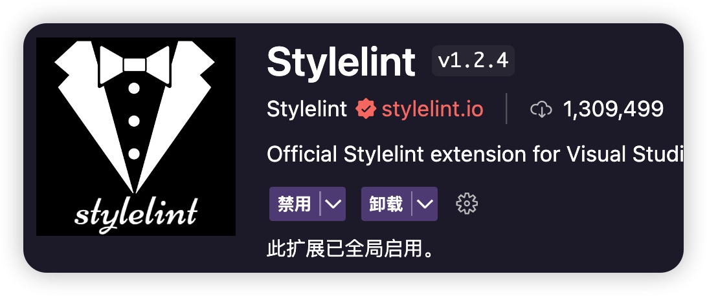
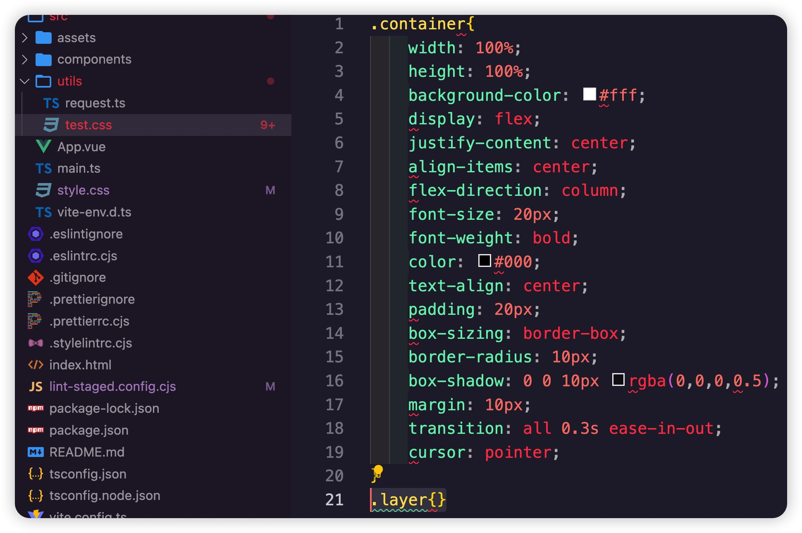
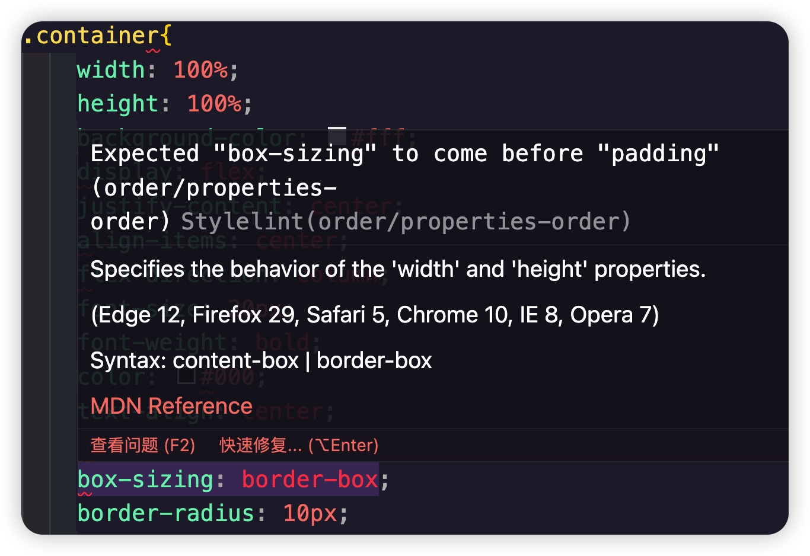
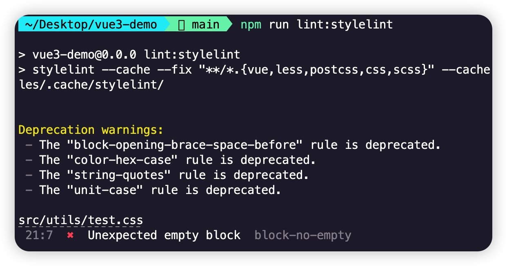
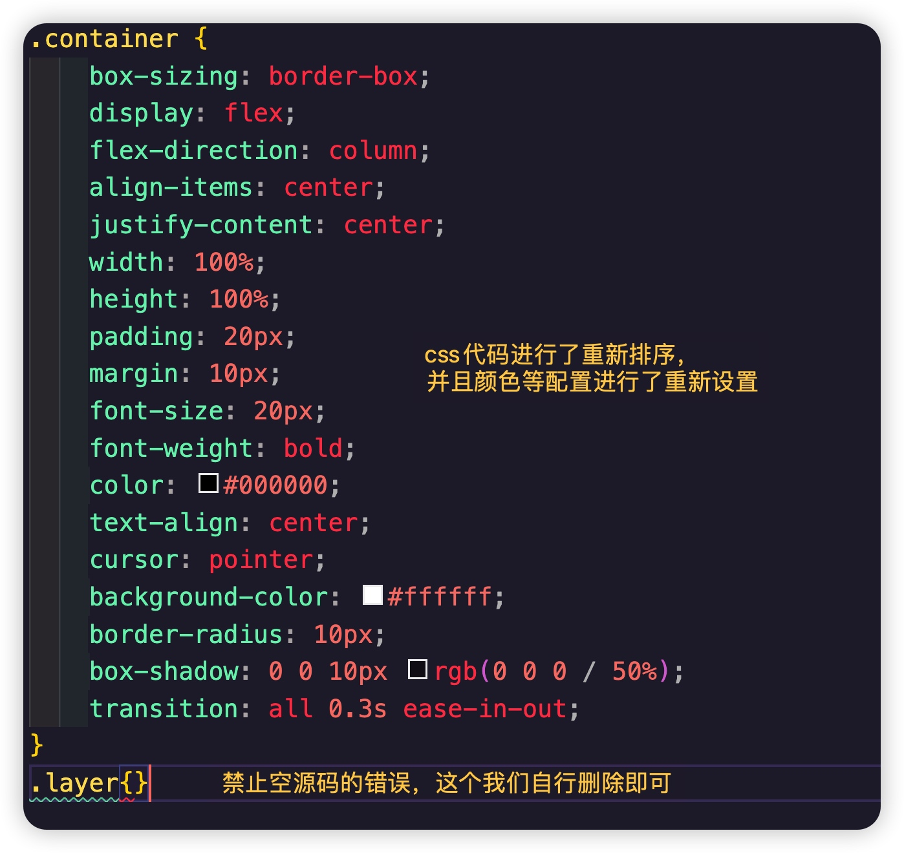

# 前端项目规范3：CSS规范（Stylelint）

## 样式规范工具（StyleLint）

### 1、安装 VSCode 插件（StyleLint）


`VS Code`插件`StyleLint`可以在编辑器中提供实时的 CSS 代码检查和提示，但是它仅仅是基于 `Stylelint` 包的扩展，不能完全取代在项目中导入 `Stylelint` 包并做一些配置的操作

### 2、在项目中下载 StyleLint 相关依赖
```js
pnpm install stylelint stylelint-config-html stylelint-config-recommended-scss stylelint-config-recommended-vue stylelint-config-standard stylelint-config-standard-scss stylelint-config-recess-order postcss postcss-html stylelint-config-prettier -D
```
> 注意：最新的`stylelint`版本可能和后面的其他包的版本产生冲突，如果你没有使用pnpm，而是npm，建议直接加上了强制安装依赖项 `--legacy-peer-deps`或者`--force`


| 依赖	| 作用描述                                                                                                                                |
|-----------------------------------|-------------------------------------------------------------------------------------------------------------------------------------------|
| stylelint                         | stylelint 核心库                                                                                                                          |
| stylelint-config-html             | Stylelint 的可共享 HTML（和类似 HTML）配置，捆绑 postcss-html 并对其进行配置。                                                                |
| stylelint-config-recommended-scss | 扩展 stylelint-config-recommended 共享配置，并为 SCSS 配置其规则                                                                           |
| stylelint-config-recommended-vue  | 扩展 stylelint-config-recommended 共享配置，并为 Vue 配置其规则                                                                            |
| stylelint-config-standard         | 打开额外的规则来执行在规范和一些 CSS 样式指南中发现的通用约定，包括：惯用 CSS 原则，谷歌的 CSS 样式指南，Airbnb 的样式指南，和 @mdo 的代码指南。 |
| stylelint-config-standard-scss    | 扩展 stylelint-config-standard 共享配置，并为 SCSS 配置其规则                                                                              |
| stylelint-config-recess-order     | 属性的排序（插件包）                                                                                                                        |
| stylelint-config-prettier         | 关闭所有不必要的或可能与 Prettier 冲突的规则                                                                                              |
| postcss                           | postcss-html 的依赖包                                                                                                                     |
| postcss-html                      | 用于解析 HTML（和类似 HTML）的 PostCSS 语法                                                                                                 |

### 3、在目录的 `.vscode` 文件夹下的 `settings.json` 文件中，加入如下配置

上面提供的`settings.json`文件已经默认加入了下面的内容。

```js
{
	"editor.formatOnSave": true,
	"editor.codeActionsOnSave": {
		"source.fixAll.stylelint": true
	},
	"stylelint.enable": true,
	"stylelint.validate": [
		"css",
		"less",
		"postcss",
		"scss",
		"vue",
		"sass",
		"html"
	],
	"files.eol": "\n"
}
```
### 4、配置 StyleLint（.stylelintrc.cjs）
```js
// @see: https://stylelint.io

module.exports = {
  root: true,
  // 继承某些已有的规则
  extends: [
    "stylelint-config-standard", // 配置 stylelint 拓展插件
    "stylelint-config-html/vue", // 配置 vue 中 template 样式格式化
    "stylelint-config-standard-scss", // 配置 stylelint scss 插件
    "stylelint-config-recommended-vue/scss", // 配置 vue 中 scss 样式格式化
    "stylelint-config-recess-order", // 配置 stylelint css 属性书写顺序插件,
    "stylelint-config-prettier" // 配置 stylelint 和 prettier 兼容
  ],
  overrides: [
    // 扫描 .vue/html 文件中的 <style> 标签内的样式
    {
      files: ["**/*.{vue,html}"],
      customSyntax: "postcss-html"
    }
  ],
  rules: {
    "function-url-quotes": "always", // URL 的引号 "always(必须加上引号)"|"never(没有引号)"
    "string-quotes": "double", // 指定字符串使用单引号或双引号 "single(单引号)"|"double(双引号)"
    "unit-case": "lower", // 指定单位的大小写 "lower(全小写)"|"upper(全大写)"
    "color-hex-case": "lower", // 指定 16 进制颜色的大小写 "lower(全小写)"|"upper(全大写)"
    "color-hex-length": "long", // 指定 16 进制颜色的简写或扩写 "short(16进制简写)"|"long(16进制扩写)"
    "rule-empty-line-before": "never", // 要求或禁止在规则之前的空行 "always(规则之前必须始终有一个空行)"|"never(规则前绝不能有空行)"|"always-multi-line(多行规则之前必须始终有一个空行)"|"never-multi-line(多行规则之前绝不能有空行)"
    "block-opening-brace-space-before": "always", // 要求在块的开大括号之前必须有一个空格或不能有空白符 "always(大括号前必须始终有一个空格)"|"never(左大括号之前绝不能有空格)"|"always-single-line(在单行块中的左大括号之前必须始终有一个空格)"|"never-single-line(在单行块中的左大括号之前绝不能有空格)"|"always-multi-line(在多行块中，左大括号之前必须始终有一个空格)"|"never-multi-line(多行块中的左大括号之前绝不能有空格)"
    "font-family-no-missing-generic-family-keyword": null, // 禁止在字体族名称列表中缺少通用字体族关键字
    "scss/at-import-partial-extension": null, // 解决不能使用 @import 引入 scss 文件
    "property-no-unknown": null, // 禁止未知的属性
    "no-empty-source": null, // 禁止空源码
    "selector-class-pattern": null, // 强制选择器类名的格式
    "value-no-vendor-prefix": null, // 关闭 vendor-prefix (为了解决多行省略 -webkit-box)
    "no-descending-specificity": null, // 不允许较低特异性的选择器出现在覆盖较高特异性的选择器
    "value-keyword-case": null, // 解决在 scss 中使用 v-bind 大写单词报错
    "selector-pseudo-class-no-unknown": [
      true,
      {
        ignorePseudoClasses: ["global", "v-deep", "deep"]
      }
    ]
  },
  ignoreFiles: ["**/*.js", "**/*.jsx", "**/*.tsx", "**/*.ts"]
};
```

同样的，为了避免到时候不必要的一些css格式化，我们可以再创建一个`.stylelintignore`文件，目的当然是忽略那些没必要的文件和文件夹

**.stylelintignore**

```js
/dist/*
/public/*
public/*
node_modules/*
```

这么配置完之后，其实在已经生成的css文件中，没有按照规范书写的css，就会提示红色波浪线的错误信息了，我们创建了一个测试的css文件，如下：



```css
.container{
  width: 100%;
  height: 100%;
  background-color:#fff;
  display: flex;
  justify-content: center;
  align-items: center;
  flex-direction: column;
  font-size: 20px;
  font-weight: bold;
  color:#000;
  text-align: center;
  padding: 20px;
  box-sizing: border-box;
  border-radius: 10px;
  box-shadow:0 0 10px □rgba(0,0,0,0.5);
  margin: 10px;
  transition: all 0.3s ease-in-out;
  cursor: pointer;
}
.layer{}
```


### 5、`package.json`添加脚本命令

```js
"scripts":{
    //...其他省略
    "lint:stylelint": "stylelint --cache --fix \"**/*.{vue,less,postcss,css,scss}\" --cache --cache-location node_modules/.cache/stylelint/",
}
```
运行脚本`npm run lint:stylelint`


