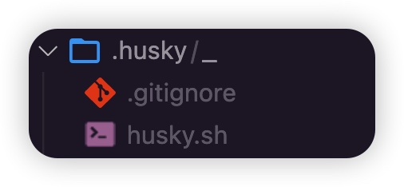
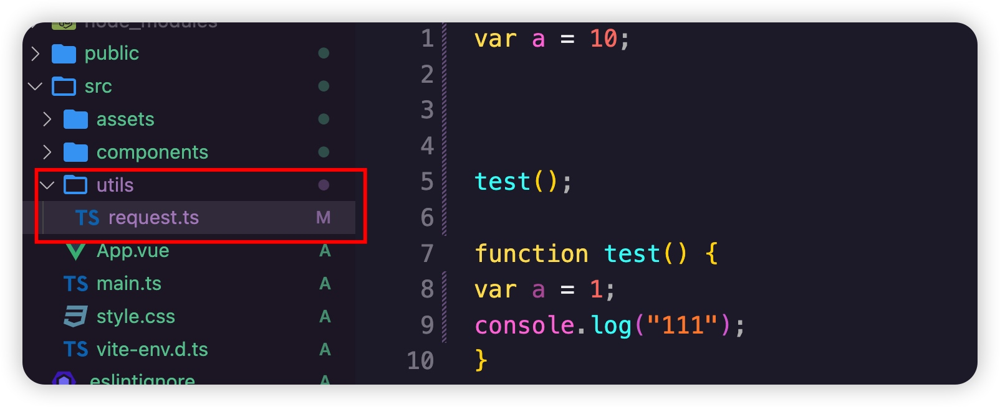
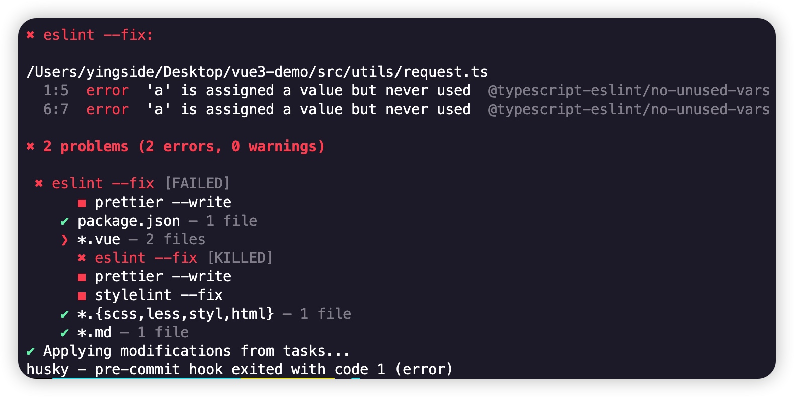
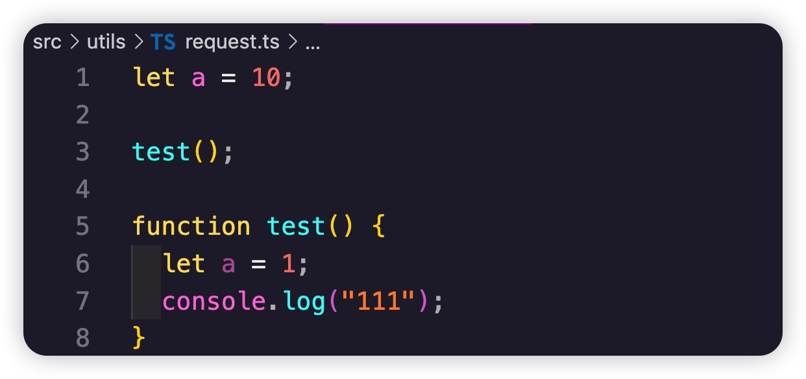
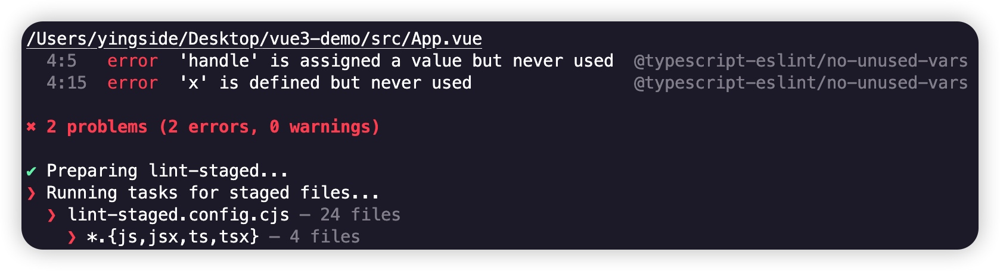
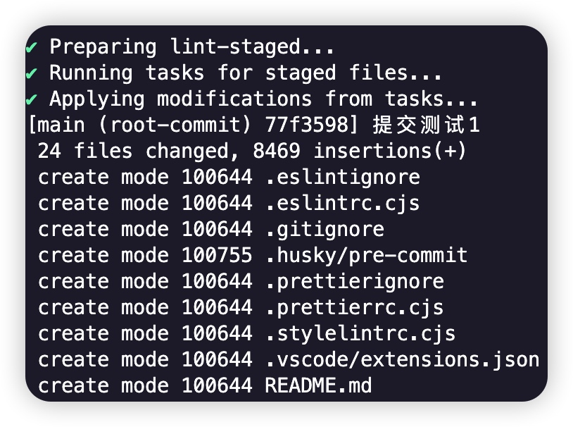

# 前端项目规范4：Git工作流规范（Husky + Lint-staged）

## Git 流程规范配置

在前端项目开发中，规范git提交信息，也是经常使用的手段，如何确保团队成员都遵循ESint规则，且不会将不符合规范的代码推送到Git仓库？

答案是：使用带有`git hooks`功能的`husky`。`git hooks`是`git`内置的功能，它会在执行Git命令之前（或之后）进行一些其它操作。例如ESLint规则校验。husky依靠git hooks来触发EsLint规则校验，并确保团队成员提交和推送代码到git之前的代码无任何问题。

### git hooks是什么?
`git hooks`是`git`在触发事件（例如：commit、push、receive）之前或之后执行的一组脚本，`git hooks`是git内置的功能，当在项目中使用 `git init`初始化`git`时就会自动添加`git hooks`，我们可以在`/.git/hooks`文件夹下找到每个事件的示例文件。

### husky是什么？
需要注意的是，`git hooks`不受版本控制，即不会提交到`git`仓库中，我们添加到`/.git/hooks`文件夹中的文件只会在本地。

那么，当团队成员克隆仓库时不会自动将我们自定义的`git hooks`下载到本地，我们又如何确保每个团队成员都执行hooks？解决这个问题的办法就是使用`husky`。

`husky`使`git hooks`更易于管理，因为我们不必手动编写代码，我们只需要再husky提供的配置文件中添加想要执行的命令，例如提交之前运行ESLint，除此之外的一切都由husky处理。

### 需要下载的插件

| 依赖| 描述                                                            |
|----------------------------------|-----------------------------------------------------------------|
| husky                            | 操作 git hooks的工具，更方便的管理 git hooks 脚本                |
| lint-staged                      | 在提交之前进行 eslint 校验                                      |
| @commitlint/cli                  | git提交规范检验工具，对提交信息的 message 规范进行校验           |
| @commitlint/config-conventional	 | 基于 conventional commits 规范的配置文件                        |
| czg                              | 交互式命令行工具生成标准化的 git commit message                 |
| cz-git                           | 一款工程性更强，轻量级，高度自定义，标准输出格式的 commitize 适配器 |


### 1、husky（操作 git 钩子的工具）

**安装`husky`**
```js
pnpm add husky@8.0.0 -D 
```

**设置`package.json`脚本命令**
```js
npm pkg set scripts.prepare="husky install"
```
这个命令其实就是在`package.json`文件中的`scripts`脚本中添加脚本命令`"prepare": "husky install"`，不想执行命令，自己手动添加脚本命令即可

**运行`prepare`脚本命令，生成`husky`文件夹**

运行这个命令之前，**确保你的工程已经初始化**`git`，没有的话，先运行`git init`命令，当然，最好也创建一下`.gitignore`文件

```typescript
# Numerous always-ignore extensions  
*.bak  
*.patch  
*.diff  
*.err  
 
# temp file for git conflict merging  
*.orig  
*.log  
*.rej  
*.swo  
*.swp  
*.zip  
*.vi  
*.sass-cache  
*.tmp.html  
*.dump  
 
# OS or Editor folders  
.DS_Store  
._*  
.cache  
.project  
.settings  
.tmproj  
*.esproj  
*.sublime-project  
*.sublime-workspace  
nbproject  
thumbs.db  
*.iml  
 
# Folders to ignore  
.hg  
.svn  
.CVS  
.idea
.next  
node_modules/  
jscoverage_lib/  
bower_components/  
dist/ 
.vscode/
```

运行npm脚本

```js
npm run prepare
```


### 2、设置git hooks

`husky`安装完成，并配置好脚本后，我们就可以进行 `git hooks` 的设置。

`git hooks`让我们能够在`git`操作的特定命令发生时自动执行自定义的脚本，用来完成一些额外的事情。

而我们在git提交信息的规范中，一般常用的两个阶段是：**pre-commit** 和 **commit-msg**

>除此以外，**git hooks**还有多个阶段，可以在需要的时候启用，比如以下这些：
>**pre-receive**：从本地版本完成一个推送后
>**prepare-commit-msg**：信息准备完成后但编辑尚未启动
>**pre-push**：push 之前执行
>**post-update**：在工作区更新完成后执行
>**pre-rebase**：在rebase操作之前执行

### pre-commit
上面介绍中，提到`husky`工具会在根目录下生成 `.husky` 目录，保存有`husky`的基本配置。要想配置 `git hooks`，还得在这个目录下进行操作，可以采取下面两种方式。

>下面的代码可以不需要运行，后面会使用`lint-staged`替代

1、我们可以直接在 `.husky` 目录下新建文件：`pre-commit`，**注意无后缀名**。然后给该文件添加以下内容：

```js
#!/usr/bin/env sh
. "$(dirname -- "$0")/_/husky.sh"

npx eslint src
```

2、**使用脚本命令生成`pre-commit`文件**
```js
npx husky add .husky/pre-commit "npx eslint src"
```

该脚本执行后，将在 `.husky` 目录下自动生成 `pre-commit` 文件，并且写入对应的脚本命令：`npx eslint src`，内容与上面的第一种方式一样。

完成以上操作后，当我们执行 `git commit` 命令时，就会自动执行`eslint`命令。除了`eslint`，我们也可以配置其他诸如 `stylelint`、`prettier` 等等。

### 3、lint-staged

使用 `husky` 后，`ESLint`会在项目中的每个文件上都运行，这是个非常糟糕的主意。因为在未更改的代码上运行`ESLint`可能会导致出乎预料的错误。

对于大型项目，在每个文件上运行`ESLint`可能会消耗大量的时间。同样，在旧项目中消耗时间解决`ESLint`抛出的问题而不是研发新功能，是没意义的事。

那么，我们如何只在我们更改的代码上运行 ESLint?

答案是**lint-staged**。它的作用是**只在当前提交中对已更改的文件运行 `pre-commit hooks`**。并且还能对代码进行更多的设置，比如使用 `prettier` 格式化代码

**安装**
```js
pnpm add lint-staged -D
```

**使用脚本命令生成`pre-commit`文件,**
```js
npx husky add .husky/pre-commit "npm run lint:lint-staged"
```
如果已经生成了`pre-commit`文件，那么在文件中，删除其他命令，添加`npm run lint:lint-staged`脚本命令即可

**在package.json文件中添加`scripts`脚本**
```js
//......其他代码省略
"scripts": {
    "dev": "vite",
    "build": "vue-tsc && vite build",
    "preview": "vite preview",
    "lint:eslint": "eslint --fix --ext .js,.ts,.vue ./src",
    "lint:prettier": "prettier --write \"src/**/*.{js,ts,json,tsx,css,less,scss,vue,html,md}\"",
    "lint:lint-staged": "lint-staged",
    "prepare": "husky install"
},
```

**新增 `lint-staged.config.cjs` 文件**

```js
module.exports = {
  "*.{js,jsx,ts,tsx}": ["eslint --fix", "prettier --write"],
  "package.json": ["prettier --write"],
  "*.vue": ["eslint --fix", "prettier --write"],
  "*.md": ["prettier --write"]
};

```
如果仅仅只是简单配置一下`lint-staged`，也可以直接在`package.json`文件中进行配置

> **.cjs** 文件其实就是js文件，只是更加明显的说明这是一个模块文件，并且模块声明遵循的是**CommonJS的标准**。因此同理，也有 **.mjs** 的文件，表明这个文件是遵循**ESM标准**（ECMAScript Modules）的模块文件

#### 测试一下
写了这么多配置了，我们测试一下


`git add .` 之后，我们使用`git commit`提交，触发`pre-commit`钩子，看看会出现什么情况



在`git commit`的时候，之前我们在`.eslintrc.cjs`中定义为`error`的项，直接帮我们定义错误，而且帮为了做好了格式化,修复掉这个问题之后，重新执行`git add .`,再次`git commit`,这次依然提示错误：

vue自动生成的代码中有未使用的函数和变量，继续修改吧......

全部修改完成后，才会提交成功!

