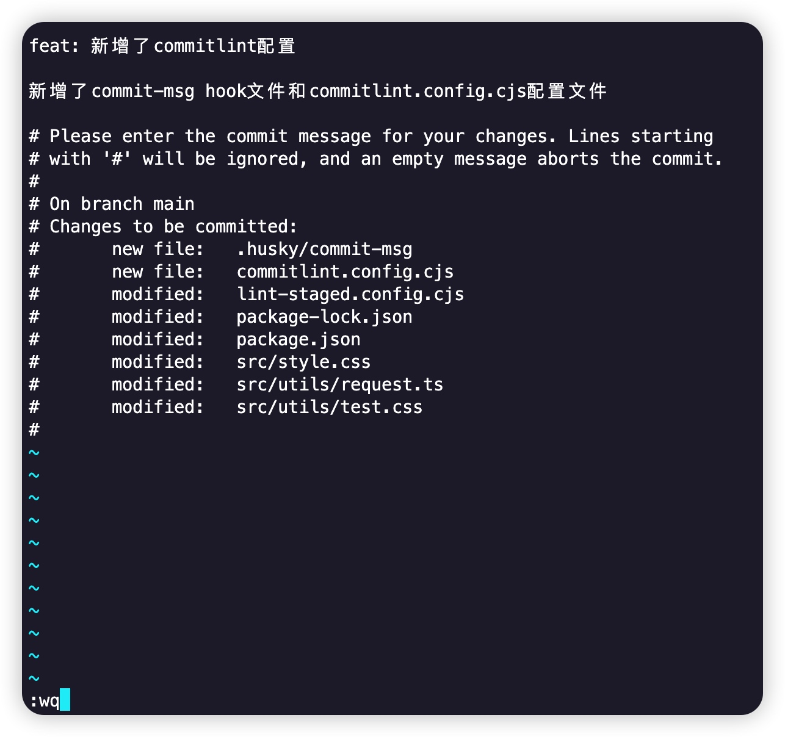
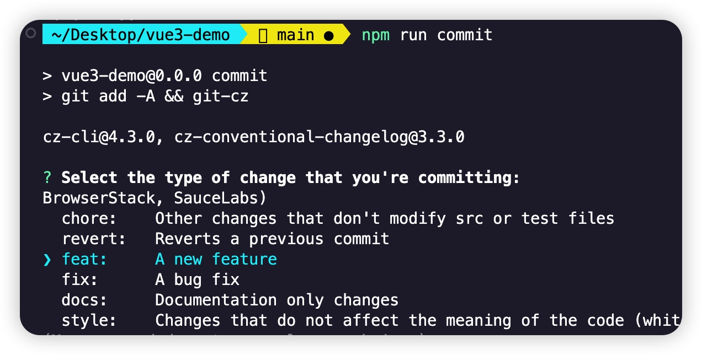
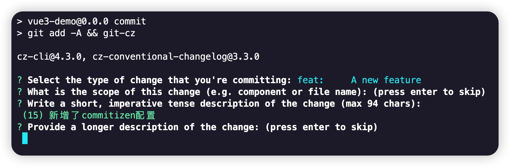
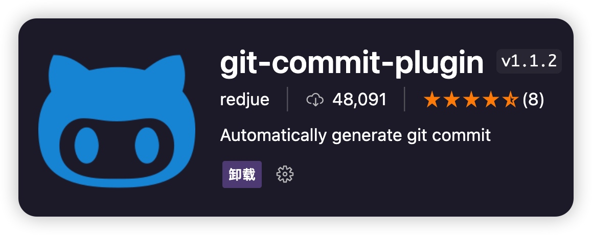
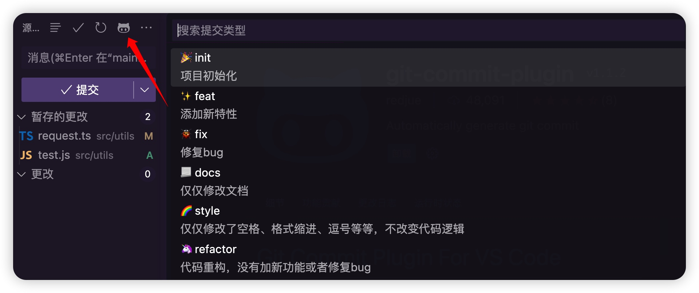

# 前端项目规范5：Git提交信息规范（Commitlint + commitizen + cz-git）

前面讲的都是在git提交之前的一些流程检查，而当我们git提交的时候，提交信息，也应该是需要规范的

### commitlint

在使用Git提交代码时，通常都需要填写提交说明，也就是Commit Message
```js
git commit -m '提交测试'
```
说白了，`Commit Message`就是我们提交的时候，在`-m`后面写的提交说明，在小项目中都是随意去写这个`message`的，但是当项目到了一定规模，什么东西都需要形成规范，包括这个提交`Message`，不然开发伙伴根本不知道你这次提交到底是在干嘛。

当然，仅仅只是口头约束并没有实质上的作用，为了禁止不符合规范的`Commit Message`的提交，我们就需要采用一些工具，只有当开发者编写了符合规范的`Commit Message`才能够进行`commit`。而`commitlint`就是这样一种工具，通过结合`husky`一起使用，可以在开发者进行`commit`前就对`Commit Message`进行检查，只有符合规范，才能够进行`commit`。

上面我们提到过，git最常用的钩子函数有两个，一个是`pre-commit`,前面我们已经对这个阶段需要做的规范做了介绍，并且还使用了`lint-staged`工具。另外一个常用的钩子函数就是`commit-msg`,在这个阶段，用到的工具就是`commitlint`

#### 安装
需要下载两个依赖包：
```js
pnpm install @commitlint/cli @commitlint/config-conventional -D
```

- @commitlint/config-conventional 是基于 conventional commits 规范的配置文件。
- @commitlint/cli 是 commitlint 工具的核心。

#### 配置
具体的规范配置可以查看：https://github.com/conventional-changelog/commitlint
我这里在项目根目录下创建了新的配置文件 `commitlint.config.cjs`

```js
module.exports = { extends: ['@commitlint/config-conventional'] };
```
这里面我写的很简单，意思其实我这里定义的`Commit Message`就是继承了`@commitlint/config-conventional 规则集`，这个规则集定义了Git 提交信息定义一致性格式，使得提交信息更易于理解和自动化处理。
```js
build: 改变了项目构建系统或外部依赖项。
ci: 更改了CI配置或脚本。
docs: 只更改文档。
feat: 新功能。
fix: 修复了一个 bug。
perf: 改进了性能。
refactor: 代码重构，既没有增加新功能，也没有修复 bug。
style: 格式化、缺少分号等；对代码逻辑没有影响的更改。
test: 增加或修改了测试代码。
```

#### 配置`commit-msg`钩子
当然，上面的`commitlint`配置好之后，我们还需要`commit-msg`钩子函数触发
```js
npx husky add .husky/commit-msg 'npx --no-install commitlint --edit "$1"'
```

#### 提交填写commit信息
现在我们提交的时候，就不需要再写`git commit -m "提交测试"`这种简单的message信息了。我们只需要执行`git commit`,钩子函数会自动帮我们弹出一个**Vim**风格的文本输入框。

>Vim 是一款经典的文本编辑器，它拥有强大的编辑和操作功能
>以下是一些常用的 Vim 风格操作：
>
> - i 进入插入模式，可以开始编辑文本。
> - Esc 退出插入模式，回到命令模式。
> - :wq 保存并退出编辑器。
> - :q! 放弃修改并退出编辑器。
> - dd 删除当前行。
> - yy 复制当前行。
> - p 粘贴复制的内容。

在Vim文本编辑器，需要填写按规范提交。符合规范的`Commit Message`的提交格式如下，包含了**页眉（header）**、**正文（body）**和**页脚（footer）**三部分。其中，header是必须的，body和footer可以忽略。
```js
type([scope]): subject
// 空一行
[body]
// 空一行
[footer]
```



需要注意的是，在`commitlint.config.cjs`配置了哪些类型，`Commit Message`时候type就只能哪些类型，想要更多的type类型，可以继承extends其他的规范集，或者自己写

### commitizen
上面这种还需要自己去一个个输入commit信息的形式很容易出现问题，因此`commitizen`做的事情很简单，就是帮我们提供了一个交互式撰写commit信息的插件。

**安装**
```js
pnpm add commitizen cz-conventional-changelog -D
```

**配置package.json脚本命令**

>下面的配置只是试验性质，原生的`commitizen`交互式提示不是太符合国情，大家可以做做试验，后面有其他插件替代

```js
"scripts": {
   //......其他省略
    "commit": "git add -A && git-cz"
},
"config": {
    "commitizen": {
      "path": "./node_modules/cz-conventional-changelog"
    }
},
```

上面在`scripts`脚本中配置了`commit`命令，用来替代`git commit`，并且合并了`git add`命令




就像上面这个样子，跟着commitizen提供的交互式步骤，一步步的信息Commit Message的填写就行了

## cz-git

`commitizen`的交互性并不是太友好，至少不是太符合国情，因此国人开发了这一款工具，工程性更强，自定义更高，交互性更好。

`cz-git`的[博客地址](https://blog.qbb.sh/post/2022/02/27/cz-git/)，记录了开发`cz-git`的心路历程

`cz-git`配置：[cz-git指南](https://cz-git.qbb.sh/zh/guide/)

**安装**

安装`cz-git`的前提是已经安装过`commitizen`，前面已经安装了这里就不在赘述
```js
pnpm add cz-git -D
```

**配置 `package.json`**
```js
"scripts":{
    "commit": "git add -A && git-cz"
}
"config": {
    "commitizen": {
        "path": "node_modules/cz-git"
    }
}
```

**配置模板**
`cz-git`给出了一些推荐配置模板：https://cz-git.qbb.sh/zh/config/，我们在之前的`commitlint.config.cjs`文件上，进行修改
```js
/* eslint-disable @typescript-eslint/no-require-imports */
// @see: https://cz-git.qbenben.com/zh/guide
const fs = require("fs");
const path = require("path");

const scopes = fs
	.readdirSync(path.resolve(__dirname, "src"), { withFileTypes: true })
	.filter((dirent) => dirent.isDirectory())
	.map((dirent) => dirent.name.replace(/s$/, ""));

/** @type {import('cz-git').UserConfig} */
module.exports = {
	ignores: [(commit) => commit.includes("init")],
	extends: ["@commitlint/config-conventional"],
	rules: {
		// @see: https://commitlint.js.org/#/reference-rules
		"body-leading-blank": [2, "always"],
		"footer-leading-blank": [1, "always"],
		"header-max-length": [2, "always", 108],
		"subject-empty": [2, "never"],
		"type-empty": [2, "never"],
		"subject-case": [0],
		"type-enum": [
			2,
			"always",
			[
				"feat",
				"fix",
				"docs",
				"style",
				"refactor",
				"perf",
				"test",
				"build",
				"ci",
				"chore",
				"revert",
				"wip",
				"workflow",
				"types",
				"release",
			],
		],
	},
	prompt: {
		messages: {
			// 中文版
			type: "选择你要提交的类型 :",
			scope: "选择一个提交范围（可选）:",
			customScope: "请输入自定义的提交范围 :",
			subject: "填写简短精炼的变更描述 :\n",
			body: '填写更加详细的变更描述（可选）。使用 "|" 换行 :\n',
			breaking: '列举非兼容性重大的变更（可选）。使用 "|" 换行 :\n',
			footerPrefixsSelect: "选择关联issue前缀（可选）:",
			customFooterPrefixs: "输入自定义issue前缀 :",
			footer: "列举关联issue (可选) 例如: #31, #I3244 :\n",
			confirmCommit: "是否提交或修改commit?"
		},
		types: [
			// 中文版
			{ value: "feat", name: "特性:   🚀  新增功能", emoji: "🚀" },
			{ value: "fix", name: "修复:   🧩  修复缺陷", emoji: "🧩" },
			{ value: "docs", name: "文档:   📚  文档变更", emoji: "📚" },
			{ value: "style", name: "格式:   🎨  代码格式（不影响功能，例如空格、分号等格式修正）", emoji: "🎨" },
			{ value: "refactor", name: "重构:   ♻️  代码重构（不包括 bug 修复、功能新增）", emoji: "♻️" },
			{ value: "perf", name: "性能:    ⚡️  性能优化", emoji: "⚡️" },
			{ value: "test", name: "测试:   ✅  添加疏漏测试或已有测试改动", emoji: "✅" },
			{ value: "build", name: "构建:   📦️  构建流程、外部依赖变更（如升级 npm 包、修改 webpack 配置等）", emoji: "📦️" },
			{ value: "ci", name: "集成:   🎡  修改 CI 配置、脚本", emoji: "🎡" },
			{ value: "chore", name: "回退:   ⏪️  回滚 commit", emoji: "⏪️" },
			{ value: "revert", name: "其他:   🔨  对构建过程或辅助工具和库的更改（不影响源文件、测试用例）", emoji: "🔨" },
			{ value: "wip", name: "开发:   🕔  正在开发中", emoji: "🕔" },
			{ value: "workflow", name: "工作流:   📋  工作流程改进", emoji: "📋" },
			{ value: "types", name: "类型:   🔰  类型定义文件修改", emoji: "🔰" }
		],
		useEmoji: true,
		scopes: [...scopes],
		customScopesAlign: "bottom",
		emptyScopesAlias: "empty",
		customScopesAlias: "custom",
		allowBreakingChanges: ["feat", "fix"],
	},
};
```


再次运行`npm run commit`


## VSCode插件 `git-commit-plugin`

实在觉得配置太繁琐，可以直接使用VSCode提供的插件 `git-commit-plugin`,当然这个插件的灵活性就比较低了。默认支持的是 `Angular Team Commit Specification`规范集


