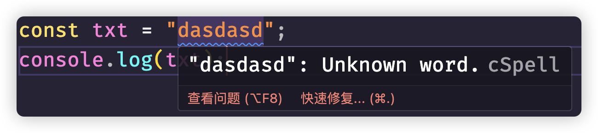
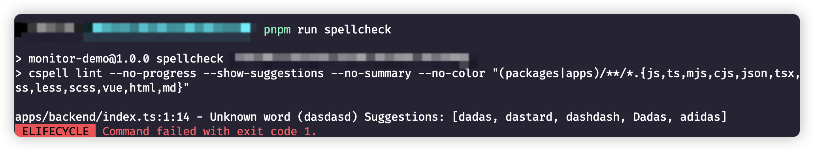
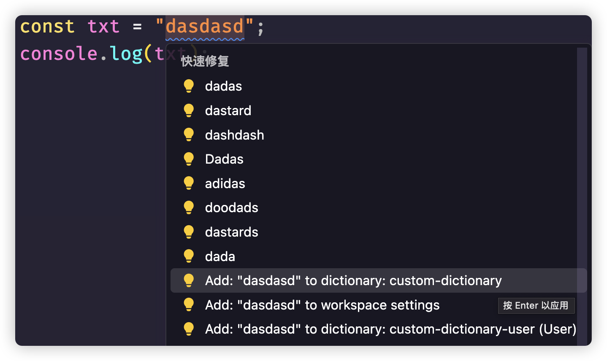
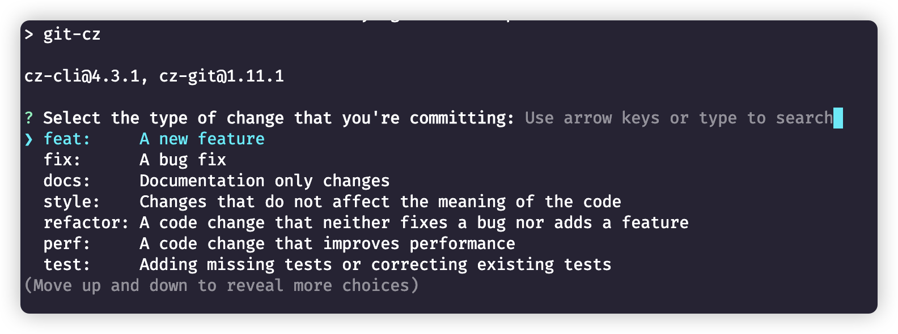

## pnpm-workspace.yaml

```shell
packages:
  - 'packages/*'
  - 'apps/backend/*'
  - 'apps/frontend/*'
  - 'demos/*'
```

## 工程规范化处理

### prettier

**下载**

```typescript
pnpm add prettier -D --workspace-root
```

**常见配置文件：**

```js
// prettier.config.mjs
/**
 * @type {import('prettier').Config}
 * @see https://www.prettier.cn/docs/options.html
 */
export default  {
	// 指定最大换行长度
	printWidth: 120,
	// 缩进制表符宽度 | 空格数
	tabWidth: 2,
	// 使用制表符而不是空格缩进行 (true：制表符，false：空格)
	useTabs: false,
	// 结尾不用分号 (true：有，false：没有)
	semi: true,
	// 使用单引号 (true：单引号，false：双引号)
	singleQuote: false,
	// 在对象字面量中决定是否将属性名用引号括起来 可选值 "<as-needed|consistent|preserve>"
	quoteProps: "as-needed",
	// 在JSX中使用单引号而不是双引号 (true：单引号，false：双引号)
	jsxSingleQuote: false,
	// 多行时尽可能打印尾随逗号 可选值"<none|es5|all>"
	trailingComma: "none",
	// 在对象，数组括号与文字之间加空格 "{ foo: bar }" (true：有，false：没有)
	bracketSpacing: true,
	// 将 > 多行元素放在最后一行的末尾，而不是单独放在下一行 (true：放末尾，false：单独一行)
	bracketSameLine: false,
	// (x) => {} 箭头函数参数只有一个时是否要有小括号 (avoid：省略括号，always：不省略括号)
	arrowParens: "avoid",
	// 指定要使用的解析器，不需要写文件开头的 @prettier
	requirePragma: false,
	// 可以在文件顶部插入一个特殊标记，指定该文件已使用 Prettier 格式化
	insertPragma: false,
	// 用于控制文本是否应该被换行以及如何进行换行
	proseWrap: "preserve",
	// 在html中空格是否是敏感的 "css" - 遵守 CSS 显示属性的默认值， "strict" - 空格被认为是敏感的 ，"ignore" - 空格被认为是不敏感的
	htmlWhitespaceSensitivity: "css",
	// 控制在 Vue 单文件组件中 <script> 和 <style> 标签内的代码缩进方式
	vueIndentScriptAndStyle: false,
	// 换行符使用 lf 结尾是 可选值 "<auto|lf|crlf|cr>"
	endOfLine: "auto",
	// 这两个选项可用于格式化以给定字符偏移量（分别包括和不包括）开始和结束的代码 (rangeStart：开始，rangeEnd：结束)
	rangeStart: 0,
	rangeEnd: Infinity,
};
```

**忽略文件（.prettierignore）**

创建`.prettierignore`文件

```typescript
/dist/*
/build/*
/public/*

.local
/node_modules/**

**/*.svg
**/*.sh
```

**`package.json`配置命令脚本**

```typescript
"scripts":{
    //......其他省略
    "lint:prettier": "prettier --write \"**/*.{js,ts,mjs,cjs,json,tsx,css,less,scss,vue,html,md}\"",
}
```

运行命令 `pnpm run lint:prettier`，就能帮你格式化整理工程下相关文件。

当然了，我们一般情况下都会在vscode中安装prettier插件，很多时候习惯性的ctrl+s就已经可以帮我们进行格式化

### ESLint

**下载：**

```typescript
pnpm add eslint@latest @eslint/js globals typescript typescript-eslint @types/node eslint-plugin-prettier eslint-config-prettier eslint-plugin-vue eslint-plugin-react-hooks eslint-plugin-react-refresh -D --workspace-root
```

**配置：**

```typescript
// eslint.config.mjs
import eslint from "@eslint/js";
import globals from "globals";
import tseslint from "typescript-eslint";
import eslintPrettier from "eslint-plugin-prettier";
import eslintPluginVue from "eslint-plugin-vue";
import reactHooks from "eslint-plugin-react-hooks";
import reactRefresh from "eslint-plugin-react-refresh";

// 前端配置
const frontendConfig = {
  files: ["apps/frontend/monitor/**/*.{js,ts,vue,jsx,tsx}"],
  ignores: ["apps/frontend/monitor/src/components/ui/**/*"],
  extends: [...eslintPluginVue.configs["flat/recommended"]],
  languageOptions: {
    ecmaVersion: 2020,
    sourceType: "module",
    globals: {
      ...globals.browser
    },
    parserOptions: {
      ecmaFeatures: {
        jsx: true
      }
    },
    parser: tseslint.parser
  },
  plugins: {
    "react-hooks": reactHooks,
    "react-refresh": reactRefresh
  },
  rules: {
    ...reactHooks.configs.recommended.rules,
    "react-refresh/only-export-components": [
      "warn",
      {
        allowConstantExport: true
      }
    ],
    "no-console": "error"
  }
};

// 后端配置
const backendConfig = {
  files: ["apps/backend/**/*.{js,ts}"],
  languageOptions: {
    globals: {
      ...globals.node
    },
    parser: tseslint.parser
  },
  rules: {
    "no-unused-vars": "off",
    "no-undef": "error"
  }
};

const ignores = ["dist", "node_modules", "build", "**/*.js", "**/*.mjs", "**/*.d.ts", "eslint.config.mjs", 'apps/frontend/monitor/src/components/ui/**/*'];

export default tseslint.config(
  // 通用配置
  {
    ignores,
    extends: [eslint.configs.recommended, ...tseslint.configs.recommended],
    plugins: {
      prettier: eslintPrettier,
      // "simple-import-sort": importSort
    },
    rules: {
      "prettier/prettier": "error",
      "@typescript-eslint/no-explicit-any": "off",
      "@typescript-eslint/no-unused-vars": "off"
      // "simple-import-sort/imports": "error",
      // "simple-import-sort/exports": "error"
    }
  },
  // 前端配置
  frontendConfig,
  // 后端配置
  backendConfig
);

```

**`package.json`配置命令脚本**

```typescript
"scripts": {
  //......其他省略
  "lint:ts": "eslint",
},
```

### 拼写检查cspell

**下载**

```shell
pnpm add cspell @cspell/dict-lorem-ipsum -D --workspace-root
```

**相关命令：**

```shell
>npx cspell lint -h

Usage: cspell lint [options] [globs...] [file://<path> ...] [stdin[://<path>]]

Patterns:
 - [globs...]            Glob Patterns
 - [stdin]               Read from "stdin" assume text file.
 - [stdin://<path>]      Read from "stdin", use <path> for file type and config.
 - [file://<path>]       Check the file at <path>

Examples:
    cspell .                        Recursively check all files.
    cspell lint .                   The same as "cspell ."
    cspell "*.js"                   Check all .js files in the current directory
    cspell "**/*.js"                Check all .js files recursively
    cspell "src/**/*.js"            Only check .js under src
    cspell "**/*.txt" "**/*.js"     Check both .js and .txt files.
    cspell "**/*.{txt,js,md}"       Check .txt, .js, and .md files.
    cat LICENSE | cspell stdin      Check stdin
    cspell stdin://docs/doc.md      Check stdin as if it was "./docs/doc.md"

Check spelling

Options:
  -c, --config <cspell.json>   Configuration file to use.  By default cspell looks for cspell.json in the current directory.
  -v, --verbose                Display more information about the files being checked and the configuration.
  --locale <locale>            Set language locales. i.e. "en,fr" for English and French, or "en-GB" for British English.
  --language-id <file-type>    Force programming language for unknown extensions. i.e. "php" or "scala"
  --words-only                 Only output the words not found in the dictionaries.
  -u, --unique                 Only output the first instance of a word not found in the dictionaries.
  -e, --exclude <glob>         Exclude files matching the glob pattern. This option can be used multiple times to add multiple globs.
  --file-list <path or stdin>  Specify a list of files to be spell checked. The list is filtered against the glob file patterns. Note:
                               the format is 1 file path per line.
  --file [file...]             Specify files to spell check. They are filtered by the [globs...].
  --no-issues                  Do not show the spelling errors.
  --no-progress                Turn off progress messages
  --no-summary                 Turn off summary message in console.
  -s, --silent                 Silent mode, suppress error messages.
  --no-exit-code               Do not return an exit code if issues are found.
  --quiet                      Only show spelling issues or errors.
  --fail-fast                  Exit after first file with an issue or error.
  -r, --root <root folder>     Root directory, defaults to current directory.
  --no-relative                Issues are displayed with absolute path instead of relative to the root.
  --show-context               Show the surrounding text around an issue.
  --show-suggestions           Show spelling suggestions.
  --no-show-suggestions        Do not show spelling suggestions or fixes.
  --no-must-find-files         Do not error if no files are found.
  --cache                      Use cache to only check changed files.
  --no-cache                   Do not use cache.
  --cache-reset                Reset the cache file.
  --cache-strategy <strategy>  Strategy to use for detecting changed files. (choices: "content", "metadata", default: "content")
  --cache-location <path>      Path to the cache file or directory. (default: ".cspellcache")
  --dot                        Include files and directories starting with `.` (period) when matching globs.
  --gitignore                  Ignore files matching glob patterns found in .gitignore files.
  --no-gitignore               Do NOT use .gitignore files.
  --gitignore-root <path>      Prevent searching for .gitignore files past root.
  --validate-directives        Validate in-document CSpell directives.
  --color                      Force color.
  --no-color                   Turn off color.
  --no-default-configuration   Do not load the default configuration and dictionaries.
  --debug                      Output information useful for debugging cspell.json files.
  --reporter <module|path>     Specify one or more reporters to use.
  --issue-template [template]  Use a custom issue template. See --help --issue-template for details.
  -h, --help                   display help for command

More Examples:

    cspell "**/*.js" --reporter @cspell/cspell-json-reporter
        This will spell check all ".js" files recursively and use
        "@cspell/cspell-json-reporter".

    cspell . --reporter default
        This will force the default reporter to be used overriding
        any reporters defined in the configuration.

    cspell . --reporter ./<path>/reporter.cjs
        Use a custom reporter. See API for details.

    cspell "*.md" --exclude CHANGELOG.md --files README.md CHANGELOG.md
        Spell check only check "README.md" but NOT "CHANGELOG.md".

    cspell "/*.md" --no-must-find-files --files $FILES
        Only spell check the "/*.md" files in $FILES,
        where $FILES is a shell variable that contains the list of files.

References:
    https://cspell.org
    https://github.com/streetsidesoftware/cspell
```

**配置文件：**

**cspell.json**

```json
{
  "import": ["@cspell/dict-lorem-ipsum/cspell-ext.json"],
  "caseSensitive": false,
  "dictionaries": ["custom-dictionary"],
  "dictionaryDefinitions": [
    {
      "name": "custom-dictionary",
      "path": "./.cspell/custom-dictionary.txt",
      "addWords": true
    }
  ],
  "ignorePaths": [
    "**/node_modules/**",
    "**/dist/**",
    "**/build/**",
    "**/lib/**",
    "**/docs/**",
    "**/vendor/**",
    "**/public/**",
    "**/static/**",
    "**/out/**",
    "**/tmp/**",
    "**/*.d.ts",
    "**/package.json",
    "**/*.md",
    "**/stats.html",
    "eslint.config.mjs",
    ".gitignore",
    ".prettierignore",
    "cspell.json",
    "commitlint.config.js"
  ],
}
```

上面的配置需要在项目根目录下创建`.cspell`文件夹，并创建`custom-dictionary.txt`文件，简单来说，就是创建了自己的词典，如果有一些不符合规范的单词，可以直接放入到该词典中，比如我们可以随便在任意地方创建一个index.ts文件测试



创建检查脚本：

```typescript
"spellcheck": "cspell lint --no-progress --show-suggestions --no-summary --no-color \"(packages|apps)/**/*.{js,ts,mjs,cjs,json,tsx,css,less,scss,vue,html,md}\"",
```

直接`pnpm run spellcheck`脚本命令的话，也会得出下面的结果



将单词直接加入我们自定义的字典即可，当然也可以使用快捷键`command + .`，直接加入我们自己的词典



> 注意，有可能你使用cspell之后不提示，那可能是因为你之前本身已经安装了相关插件，或者在VSCode的用户设置里面，已经设置了`cSpell.ignoreWords`属性

### Git提交信息规范

**下载：**

```shell
pnpm add @commitlint/cli @commitlint/config-conventional commitizen cz-git -D --workspace-root
```

- @commitlint/config-conventional 是基于 conventional commits 规范的配置文件。
- @commitlint/cli 是 commitlint 工具的核心。
- commitizen提供了一个交互式撰写commit信息的插件
- [cz-git](https://cz-git.qbb.sh/zh/guide/)是国人开发了这一款工具，工程性更强，自定义更高，交互性更好。

**package.json配置：**

```typescript
"scripts": {
  // 其他省略
	"commit": "git-cz"
},
"config": {
  "commitizen": {
    "path": "node_modules/cz-git"
  }
}
```

当然，既然是git提交规范，我们的项目肯定需要进行git相关的初始化工作

```git
git init
```

然后导入`.gitignore`文件

```.gitignore
# Numerous always-ignore extensions  
*.bak  
*.patch  
*.diff  
*.err  

# temp file for git conflict merging  
*.orig  
*.log  
*.rej  
*.swo  
*.swp  
*.zip  
*.vi  
*.sass-cache  
*.tmp.html  
*.dump  

# OS or Editor folders  
.DS_Store  
._*  
.cache  
.project  
.settings  
.tmproj  
*.esproj  
*.sublime-project  
*.sublime-workspace  
nbproject  
thumbs.db  
*.iml  

# Folders to ignore  
.hg  
.svn  
.CVS  
.idea
.next  
node_modules/  
jscoverage_lib/  
bower_components/  
dist/ 
.vscode/
```

然后执行：

```git
git add .
```

现在要进行git提交，就可以直接执行我们配置的脚本

```shell
pnpm commit
```



当然这是全英文的，如果你希望中文，并且还能添加Emoji，可以参照`cz-git`给我们提供的[相关模板](https://cz-git.qbb.sh/zh/config/)，通过**commitlint**配置文件进行配置

我这里给大家组合了一个：**commitlint.config.js**

```js
const fs = require("fs");
const path = require("path");

const scopes = fs
  .readdirSync(path.resolve(__dirname), { withFileTypes: true })
  .filter(dirent => dirent.isDirectory())
  .map(dirent => dirent.name.replace(/s$/, ""));

/** @type {import('cz-git').UserConfig} */
module.exports = {
  ignores: [commit => commit.includes("init")],
  extends: ["@commitlint/config-conventional"],
  rules: {
    // @see: https://commitlint.js.org/#/reference-rules
    "body-leading-blank": [2, "always"],
    "footer-leading-blank": [1, "always"],
    "header-max-length": [2, "always", 108],
    "subject-empty": [2, "never"],
    "type-empty": [2, "never"],
    "subject-case": [0],
    "type-enum": [
      2,
      "always",
      [
        "feat",
        "fix",
        "docs",
        "style",
        "refactor",
        "perf",
        "test",
        "build",
        "ci",
        "chore",
        "revert",
        "wip",
        "workflow",
        "types",
        "release"
      ]
    ]
  },
  prompt: {
    messages: {
      // 中文版
      type: "选择你要提交的类型 :",
      scope: "选择一个提交范围（可选）:",
      customScope: "请输入自定义的提交范围 :",
      subject: "填写简短精炼的变更描述 :\n",
      body: '填写更加详细的变更描述（可选）。使用 "|" 换行 :\n',
      breaking: '列举非兼容性重大的变更（可选）。使用 "|" 换行 :\n',
      footerPrefixsSelect: "选择关联issue前缀（可选）:",
      customFooterPrefixs: "输入自定义issue前缀 :",
      footer: "列举关联issue (可选) 例如: #31, #I3244 :\n",
      confirmCommit: "是否提交或修改commit?"
    },
    types: [
      // 中文版
      { value: "feat", name: "特性:   🚀  新增功能", emoji: "🚀" },
      { value: "fix", name: "修复:   🧩  修复缺陷", emoji: "🧩" },
      { value: "docs", name: "文档:   📚  文档变更", emoji: "📚" },
      { value: "style", name: "格式:   🎨  代码格式（不影响功能，例如空格、分号等格式修正）", emoji: "🎨" },
      { value: "refactor", name: "重构:   ♻️  代码重构（不包括 bug 修复、功能新增）", emoji: "♻️" },
      { value: "perf", name: "性能:   ⚡️  性能优化", emoji: "⚡️" },
      { value: "test", name: "测试:   ✅  添加疏漏测试或已有测试改动", emoji: "✅" },
      {
        value: "build",
        name: "构建:   📦️  构建流程、外部依赖变更（如升级 npm 包、修改 webpack 配置等）",
        emoji: "📦️"
      },
      { value: "ci", name: "集成:   🎡  修改 CI 配置、脚本", emoji: "🎡" },
      { value: "chore", name: "回退:   ⏪️  回滚 commit", emoji: "⏪️" },
      { value: "revert", name: "其他:   🔨  对构建过程或辅助工具和库的更改（不影响源文件、测试用例）", emoji: "🔨" },
      { value: "wip", name: "开发:   🕔  正在开发中", emoji: "🕔" },
      { value: "workflow", name: "工作流:   📋  工作流程改进", emoji: "📋" },
      { value: "types", name: "类型:   🔰  类型定义文件修改", emoji: "🔰" }
    ],
    useEmoji: true,
    scopes: [...scopes],
    customScopesAlign: "bottom",
    emptyScopesAlias: "empty",
    customScopesAlias: "custom",
    allowBreakingChanges: ["feat", "fix"]
  }
};

```

### husky

#### git hooks是什么?

`git hooks`是`git`在触发事件（例如：commit、push、receive）之前或之后执行的一组脚本，`git hooks`是git内置的功能，当在项目中使用 `git init`初始化`git`时就会自动添加`git hooks`，我们可以在`/.git/hooks`文件夹下找到每个事件的示例文件。

#### [husky](https://typicode.github.io/husky/)是什么？

需要注意的是，`git hooks`不受版本控制，即不会提交到`git`仓库中，我们添加到`/.git/hooks`文件夹中的文件只会在本地。

那么，当团队成员克隆仓库时不会自动将我们自定义的`git hooks`下载到本地，我们又如何确保每个团队成员都执行hooks？解决这个问题的办法就是使用`husky`。

`husky`使`git hooks`更易于管理，因为我们不必手动编写代码，我们只需要再husky提供的配置文件中添加想要执行的命令，例如提交之前运行ESLint，除此之外的一切都由husky处理。其实，我们就可以简单理解husky就是一个git的拦截器

**下载：**

```shell
pnpm add husky -D --workspace-root
```

> 注意，最新的husky是9版本，使用起来更加方便，不过和之前8版本不兼容

直接初始化husky

```typescript
npx husky init
```

> 注意：执行`husky init`之前，需要确保`git init`已经执行，也就是git仓库至少已经建立，不然也没有任何意义

在`pre-commit`中配置我们在提交之前需要执行的相关脚本就行了

```typescript
#!/usr/bin/env sh

pnpm lint:ts && pnpm lint:prettier && pnpm spellcheck
```

这样当我们执行`pnpm commit`命令进行git提交的时候，就会先运行相关的脚本，如果有问题，commit提交就会回退，直到你修改正确为止
