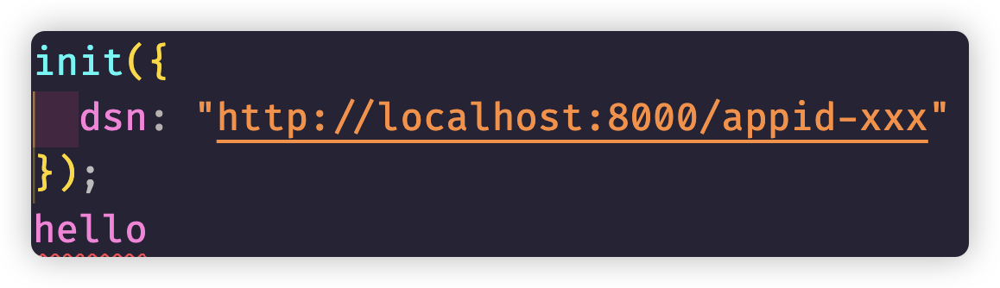
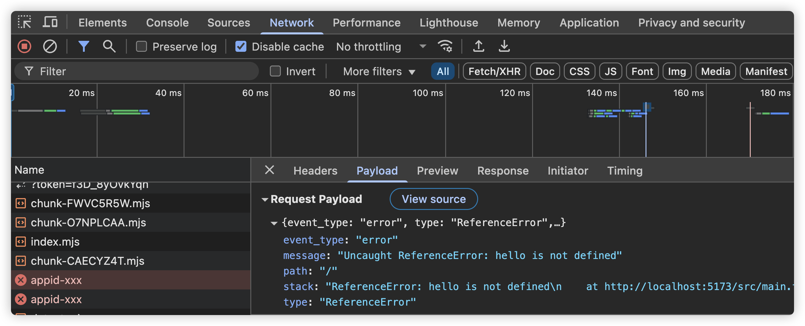

## 错误与性能采集子包处理

创建`transport`和`tracing`文件夹，分别处理上报和错误等相关内容的处理

**transport/index.ts**

```typescript
// 这个其实应该声明在core包中
export interface Transport {
  send(data: Record<string, unknown>): void;
}

export class BrowserTransport implements Transport {
  constructor(private dsn: string) {}

  send(data: Record<string, unknown>) {
    const payload = {
      ...data
      // 其他要添加的数据
    };

    // 使用 fetch 上报数据
    fetch(this.dsn, {
      method: "POST",
      headers: {
        "Content-Type": "application/json"
      },
      body: JSON.stringify(payload)
    }).catch(error => {
      console.error("Error sending data:", error);
    });
  }
}
```

**tracing/errorsIntegration.ts**

```typescript
import { Transport } from "../transport";

export class Errors {
  constructor(private transport: Transport) {}
  init() {
    window.onerror = (message, source, lineno, colno, error) => {
      this.transport.send({
        event_type: "error",
        type: error?.name,
        stack: error?.stack,
        message,
        path: window.location.pathname
      });
    };

    window.onunhandledrejection = event => {
      this.transport.send({
        event_type: "error",
        type: "unhandled_rejection",
        stack: event.reason?.stack,
        message: event.reason?.message,
        path: window.location.pathname
      });
    };
  }
}

```

### core包处理

上面的一些代码，其实应该由core包提供，由于配置几乎一样，所以直接将browser包中的配置项文件都直接拷贝到core包中即可，只需要将package.json中的name修改为`@duyi/monitor-sdk-core`即可.

同时，为了编译正确，tsup配置中，iife的name记得改一个名字，比如

```typescript
{
  entry: ["src"],
  format: ["iife"],
  outDir: "build/umd",
  name: "duyi-monitor-sdk-core"
}
```

首先约定的Transport协议，就应该在core包中声明：

```typescript
export interface Transport {
  send(data: Record<string, unknown>): void;
}
```

另外Monitor的内容也是属于基础性构建内容，也应该在core包中进行声明，负责核心层面监控SDK的内容。

不过在此之前，根据之前的分析，其实最重要的部分一方面是Monitor，另外就是需要整合进来的插件内容，然后上报，我们这core中，先把这部分的类型整理好，创建types文件夹`index.ts`

```typescript
// 上报格式
import { Transport } from "../transport";

// 插件基本协议格式
export interface IIntegration {
  init(transport: Transport): void;
}

// 插件的基本实现
export class Integration implements IIntegration {
  transport: Transport | null = null;
  init(transport: Transport): void {
    this.transport = transport;
  }
}

// Monitor的初始化选项
export interface MonitorOptions {
  dsn: string; // 数据源名称
  integrations?: IIntegration[]; // 集成的插件列表
}

```

接下来，就是实现Monitor

```typescript
import { Transport } from "./transport";
import { MonitorOptions } from "./types";

export let getTransport: () => Transport | null = () => null;

export class Monitor {
  private transport: Transport | null = null;

  constructor(private options: MonitorOptions) {}

  init(transport: Transport): void {
    this.transport = transport;
    getTransport = () => transport;
    // 如果有integration插件，就应该消费相关插件
    for (const integration of this.options.integrations ?? []) {
      integration.init(transport);
    }
  }
}

```

当然，为了外部引用方便，根目录下需要i`ndex.ts`文件，将core包中的内容导出

```typescript
export type { Integration } from "./types";
export type { Transport } from "./transport";
export { Monitor, getTransport } from "./monitor";
```

接下来，当然是要在browser中使用core包中的内容，同样使用pnpm monorepo的方式在package.json中进行引入

```typescript
"dependencies": {
  "@duyi/monitor-sdk-core": "workspace:*"
},
```

然后执行`pnpm i`,在browser中引入core包的内容

编译一下core包的内容

```typescript
pnpm run build:watch
```

这样，就能从core包中引入相关的内容了

```typescript
import { Transport } from "@duyi/monitor-sdk-core";
```

### browser的index.ts处理

由于代码进行的拆分，因此在browser包中的index.ts文件中的内容，我们需要重新进行处理

```typescript
import { Integration, Monitor } from "@duyi/monitor-sdk-core";
import { BrowserTransport } from "./transport";
import { Errors } from "./tracing/errorsIntegration";

export const init = (options: { dsn: string; integrations?: Integration[] }) => {
  const monitor = new Monitor(options);

  // 定义上报逻辑
  // transport会调用send方法来上报数据
  // 但是我们这里不需要关注，只是进行抽象，需要具体哪些对象来进行即可
  const transport = new BrowserTransport(options.dsn);

  monitor.init(transport);

  // 错误采集
  new Errors(transport).init();
  // 性能采集
  // new Metrics(transport).init();

  return monitor;
};
```

这样，在demos中的项目，我们就可以测试引入的效果了，比如，随便报一个错误：



打开浏览器，就可以看到这个错误其实已经上报了，只是我们现在还没有后端接口而已：



### Metrics信息收集

由于配置基本一致，我们还是把配置项直接拷贝过来，和之前一样，稍微修改即可

只需要将package.json中的name修改为`@duyi/monitor-sdk-browser-utils`即可.

同时，为了编译正确，tsup配置中，iife的name记得改一个名字，比如

```typescript
{
  entry: ["src"],
  format: ["iife"],
  outDir: "build/umd",
  name: "monitor-sdk-browser-utils"
}
```

这里收集的信息，主要是浏览器信息，web-vitals和Performance性能相关信息，所以我们可以先在src目录下面创建`index.ts`

```typescript
export function getBrowserInfo() {
  return {
    userAgent: navigator.userAgent,
    platform: navigator.platform,
    language: navigator.language,
    referrer: document.referrer,
    path: location.pathname
  };
}

```

然后处理性能采集信息，代码设计我们一致化处理，和之前处理Error一样，我们创建`integrations`文件夹下的`metrics.ts`文件

```typescript
import { Transport } from "@duyi/monitor-sdk-core";

export class Metrics {
  constructor(private transport: Transport) {}
  init() {}
}

```

当然，Transport我们还是要通过monorepo引入，由于配置项已经拷贝过来了，执行一下`pnpm i`命令即可。

当然，要收集性能相关数据，我们可以在当前项目`monitor-sdk-browser-utils`中引入web-vitals包

```typescript
pnpm add web-vitals
```

这样我们就可以简单的在Metrics类中使用

```typescript
import { Transport } from "@duyi/monitor-sdk-core";
import { onCLS, onFCP, onINP, onLCP, onTTFB } from "web-vitals";

export class Metrics {
  constructor(private transport: Transport) {}
  init() {
    [onCLS, onFCP, onINP, onLCP, onTTFB].forEach(metricFn => {
      metricFn(metric => {
        this.transport.send({
          event_type: "performance",
          type: "web_vitals",
          name: metric.name,
          value: metric.value,
          path: window.location.pathname
        });
      });
    });
  }
}

```

当然，需要在index.ts中导出

```typescript
export function getBrowserInfo() {
  return {
    userAgent: navigator.userAgent,
    platform: navigator.platform,
    language: navigator.language,
    referrer: document.referrer,
    path: location.pathname
  };
}

export { Metrics } from "./integrations/metrics";
```

然后编译

```
pnpm run build:watch
```

这样，我们就可以在browser包中使用了，还是通过monorepo的方式引入进来

```typescript
"dependencies": {
  "@duyi/monitor-sdk-core": "workspace:*",
  "@duyi/monitor-sdk-browser-utils": "workspace:*"
},
```

在index.ts代码中，我们就可以打开性能采集的处理

```diff
import { Integration, Monitor } from "@duyi/monitor-sdk-core";
import { BrowserTransport } from "./transport";
import { Errors } from "./tracing/errorsIntegration";
+import { Metrics } from "@duyi/monitor-sdk-browser-utils";

export const init = (options: { dsn: string; integrations?: Integration[] }) => {
  const monitor = new Monitor(options);

  // 定义上报逻辑
  // transport会调用send方法来上报数据
  // 但是我们这里不需要关注，只是进行抽象，需要具体哪些对象来进行即可
  const transport = new BrowserTransport(options.dsn);

  monitor.init(transport);

  // 错误采集
  new Errors(transport).init();
+  // 性能采集
+  new Metrics(transport).init();

  return monitor;
};
```

这样，再次运行vanilla项目，就可以看到Metrics性能数据进行了上报

### 全局运行脚本

由于我们项目比较多，如果每次打开不同的文件夹去运行太麻烦了，我们可以在根目录下直接使用pnpm命令快捷的启动相关命令：

```typescript
"build:watch":"pnpm --filter @duyi/* build:watch"
```

