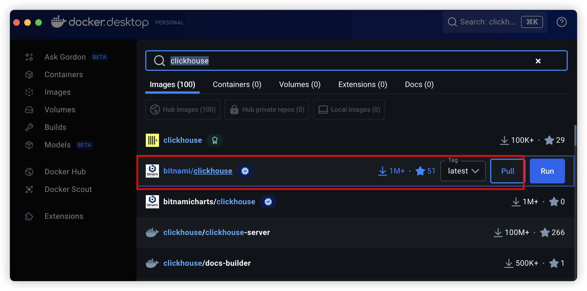
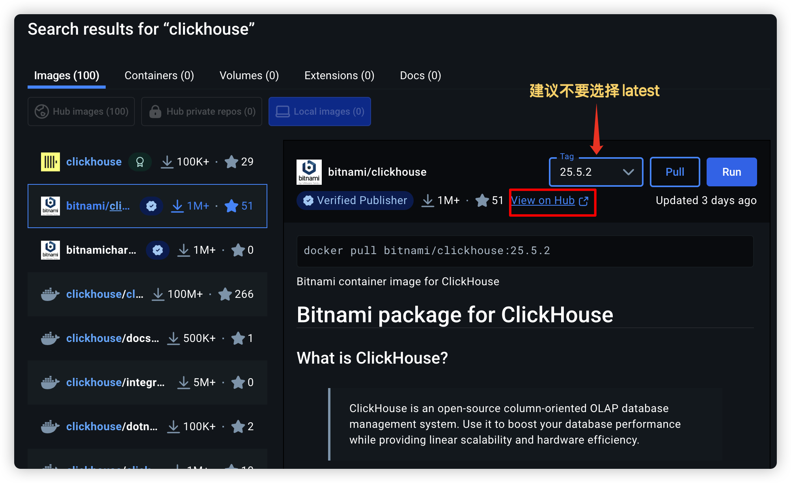
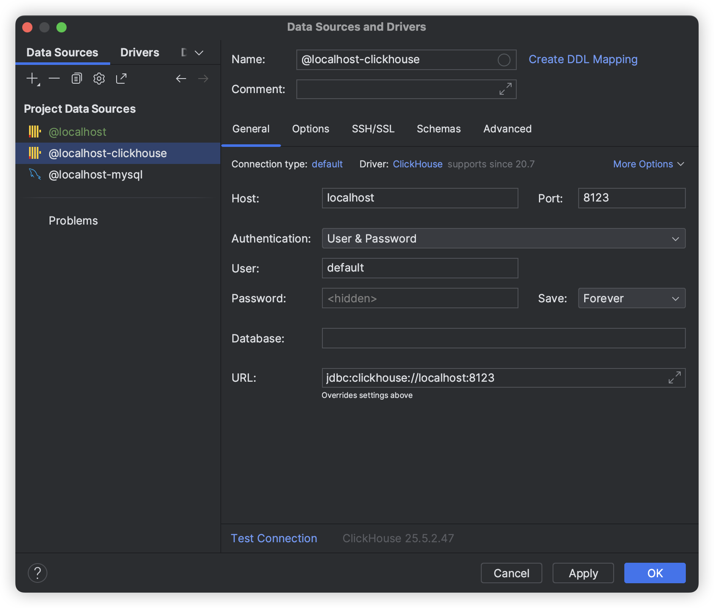

### clickhouse

[ClickHouse](https://clickhouse.com/docs/zh/intro) 是一个为大规模数据分析而优化的列式数据库，支持高吞吐量的实时查询

核心技术点就是**列式存储**，也就是说，**数据按列（而不是按行）存储在磁盘上**，这样做的优势是：

- **压缩率高：** 同一列的数据类型相同，压缩算法效率极高，大幅减少磁盘占用和 I/O。
- **读取高效：** 分析查询通常只涉及少数几列。列式存储只需读取查询所需的列，避免了读取整行数据的浪费。
- **惊人的查询速度：** 这是 ClickHouse 最著名的特点。其设计目标就是极致的查询性能，尤其擅长 `COUNT`, `SUM`, `AVG`, `GROUP BY`, `JOIN` 等聚合操作。速度通常是传统行式数据库的 100 倍甚至更多。

所以，列式存储的典型使用场景，就是下面这些：

- 用户行为分析（网站/APP 点击流分析）
- 实时报表和商业智能（BI）
- 广告网络和 RTB（实时竞价）分析
- 电信数据分析
- 日志与事件分析
- 时序数据分析（监控、传感器数据）
- ......

> **名词解释：**
>
> **`OLTP`与`OLAP`**
>
> **OLTP 例子（你使用淘宝购物）：**
>
> 你下单买了一条裤子，涉及如下行为：
>
> - 插入订单表（写操作）
> - 扣减库存（写操作）
> - 查询订单详情（读操作）
>
> 这些都是高频、小数据量、要**立即响应**的事务，适合 OLTP。
>
> 
>
> **OLAP 例子（淘宝运营人员看销售数据）：**
>
> 一个运营想知道：
>
> - 最近 30 天裙装销量走势
> - 不同省份购买用户的性别分布
> - 每天的订单总数和总金额
>
> 这些查询需要：
>
> - 聚合、分组、大量数据扫描
> - 响应时间容忍几百毫秒甚至几秒
> - 每天更新一次即可
>
> 这种就属于 OLAP。
>
> 
>
> **ClickHouse 就是典型 OLAP 数据库**
>
> ClickHouse 是为 OLAP 优化的：
>
> - 批量写入性能高，支持千万级数据导入
> - 查询时支持多字段聚合、分组、过滤
> - 借助 `ORDER BY` 和分区可大幅加快查询速度
> - 不支持 UPDATE/DELETE（但支持批量替换）

### 使用docker安装





### 使用服务编排

在根目录下创建`.dccontainer`文件夹，创建`docker-compose.yml`文件

```typescript
version: "3"

services:
  duyi-monitor-clickhouse:
    image: bitnami/clickhouse:25.5.2
    container_name: duyi-monitor-clickhouse
    ports:
      - "8123:8123"
      - "9000:9000"
    environment:
      - CLICKHOUSE_USER=default
      - CLICKHOUSE_PASSWORD=123456
      - CLICKHOUSE_DATABASE=default

networks:
    default:
      name: duyi-monitor-network
      driver: bridge
```

在根目录的package.json文件夹下创建`docker compose`多容器编排工具命令

```typescript
"docker:start": "docker compose -p duyi-monitor -f .dccontainer/docker-compose.yml up -d"
```

其中

- -p 项目名

- -f 服务编排文件名

- docker compose up -d  启动并后台运行服务

接下来，就能通过相关工具测试连接：



**创建存储表**

```sql
-- 创建存储表
-- 删除已有的表（如果存在）
DROP TABLE IF EXISTS monitor_storage;

-- 创建新的表，包含 event_type 和 message 字段
CREATE TABLE monitor_storage
(
    app_id     String,                                                -- 应用 ID，存储为字符串
    event_type String,                                                -- 事件类型，存储为字符串
    message    String,                                                -- 消息内容，存储为字符串
    created_at DateTime('Asia/Shanghai') DEFAULT now('Asia/Shanghai') -- 时间戳，默认值为当前时间
) 
    ENGINE = MergeTree() 
        ORDER BY tuple();
```

> 在 ClickHouse 中，表必须指定 **存储引擎（Engine）**，类似于 MySQL 的 InnoDB、MyISAM。ClickHouse 的核心引擎是 `MergeTree` 及其变体，比如 `ReplacingMergeTree`、`SummingMergeTree` 等。
>
> 和普通的数据库一样，ClickHouse创建表也需要指定主键，可以使用`PRIMARY KEY`进行指定。如下：
>
> ```sql
> CREATE TABLE helloworld.my_first_table
> (
>     user_id UInt32,
>     message String,
>     timestamp DateTime,
>     metric Float32
> )
> ENGINE = MergeTree()
> PRIMARY KEY (user_id, timestamp)
> ```
>
> 不过可以使用排序键（ordering key）来指代主键（primary key），语法：`ORDER BY (app_id, event_type)`，比如：
>
> ```sql
> CREATE TABLE monitor_storage
> (
>     app_id     String,
>     event_type String,
>     message    String,
>     created_at DateTime('Asia/Shanghai') DEFAULT now('Asia/Shanghai')
> )
> ENGINE = MergeTree()
> ORDER BY (app_id, created_at); 
> ```
>
> 这样就相当于指定了了**主键（主索引）**，影响数据在磁盘上的排序方式和查询效率
>
> `ORDER BY tuple()` 语法是 ClickHouse 的特殊写法，表示一个空的排序键（等价于没有主键索引），主要用于测试或无特定查询优化需求的场景。也就是没有特定需求的使用，也要**使用 `tuple()` 占位**


注意，时区选择上海，不然差8个时区，查询相关时区的sql语句

```typescript
select * from system.time_zones
```

和普通sql语句一样，插入数据：

```typescript
insert into monitor_storage(app_id, event_type, message)
values ('app1', 'event1', 'message1'),
       ('app2', 'event2', 'message2'),
       ('app3', 'event3', 'message3'),
       ('app4', 'event4', 'message4')
```

### 物化视图

物化视图 就是一个 **自动维护的表**，由其他表数据计算而来，**数据写入源表时，物化视图会自动更新**

#### 什么时候需要创建物化视图？

- **重复查询相同的聚合逻辑**，比如：

```sql
SELECT app_id, toDate(created_at) as day, count(*) as cnt
FROM monitor_storage
GROUP BY app_id, day
```

- **避免在业务查询中重复 JOIN / GROUP BY / ORDER BY**

比如埋点日志表非常大，但你只关心某个字段统计，创建物化视图就能让查询变成毫秒级

- **减少资源消耗，避免实时聚合压力**

如果用户量很大，每次都聚合全表非常吃资源，有了物化视图，只需要查轻量级视图表

- **和 Kafka / Buffer 表搭配使用**

`ClickHouse` + `Kafka` 的常见做法：

- 实时写入原始表
- 物化视图实时聚合到汇总表

```sql
-- 删除已有的物化视图（如果存在）
DROP TABLE IF EXISTS monitor_view;

-- 创建物化视图
CREATE MATERIALIZED VIEW monitor_view
            ENGINE = MergeTree()
                ORDER BY tuple() -- 定义排序规则
            POPULATE -- 立即填充数据
AS
SELECT *,
       -- 在此可以对 原始数据 进行任何所需的处理或选择部分字段
       concat('monitor--', event_type) AS processed_message,
       now('Asia/Shanghai')           AS view_created_at
FROM monitor_storage;
```

然后就能通过查询命令读取到物化视图的数据：

```typescript
select * from monitor_view
```

