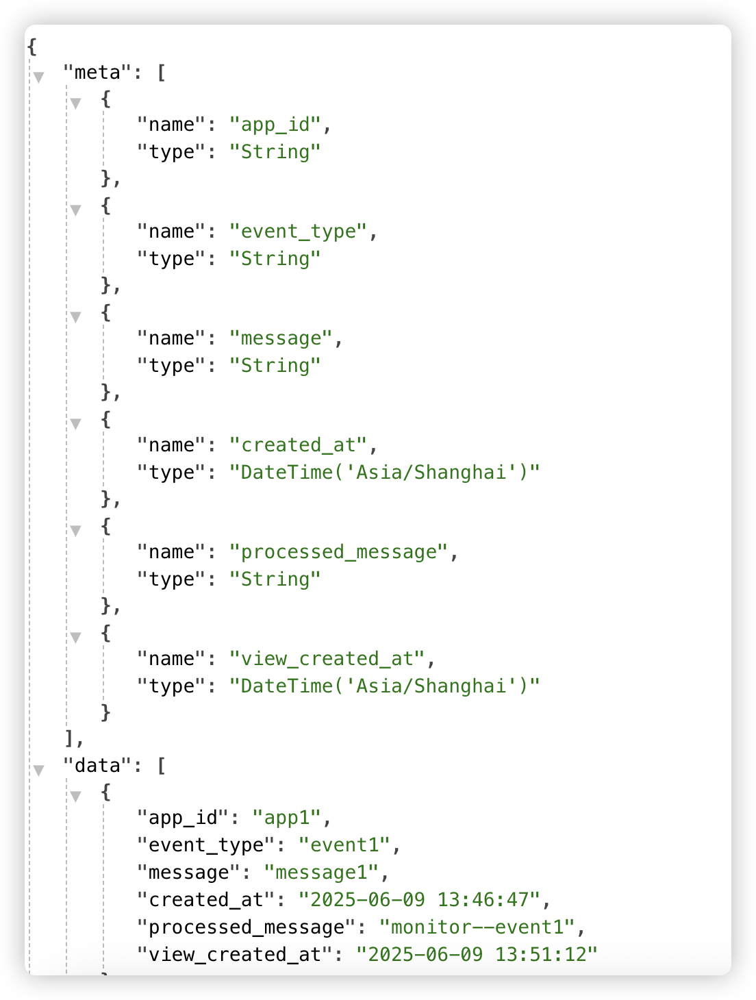
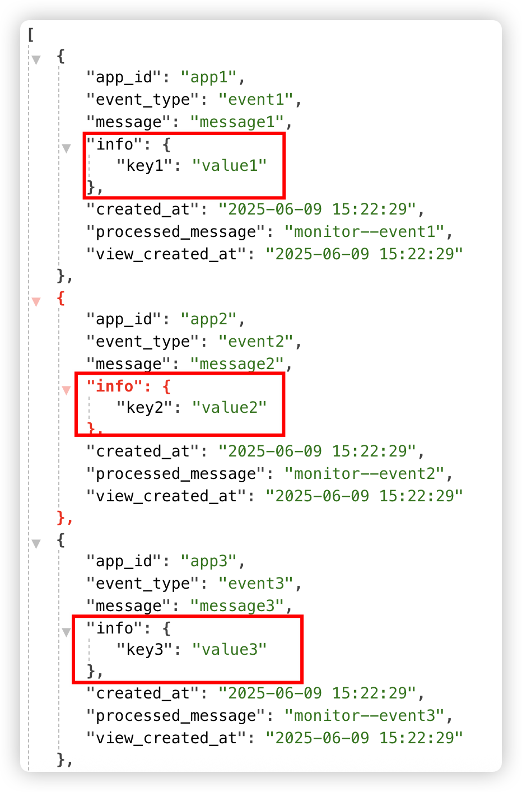
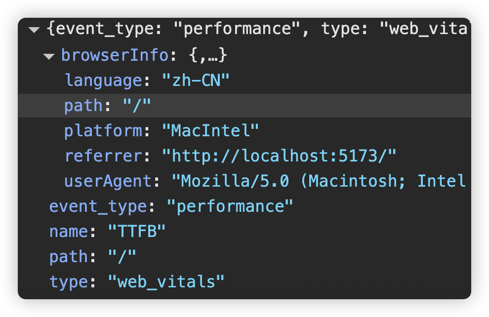

## 创建Nest.js项目

在项目的apps的backend目录下创建后端项目，这个项目主要给我们提供后端api接口，使用命令:

```shell
nest n dsn-server -g -p pnpm
```

当然使用nest命令的前提是你需要先全局安装他，如果不熟悉nest.js的话，请先观看nest.js相关视频

首先项目初始化了一个规范，以及相关的配置，比如tsconfig我们在根目录中已经配置过了，因此，我们直接继承外部配置即可

**tsconfig.json**

```json
{
  "extends": "../../../tsconfig.server.json",
  "compilerOptions": {
    "outDir": "./dist"
  }
}

```

规范相关的`.gitignore`，`.prettoerrc`，`eslint.config.mjs`等相关文件，直接删除即可，测试相关内容，比如`test`相关文件夹，也可以全部删除。

当然在package.json中，相关引入的包，我们也可以直接清理掉

处理完成之后，在`dsn-server`项目下，重新执行一下`pnpm i`命令

运行`pnpm run start:dev`,能够直接在**3000端口**获取根目录下的接口，得到`hello world`表示项目初始化就没啥问题了

## 引入`clickhouse`

当前项目下安装：

```shell
pnpm add @clickhouse/client
```

然后定义动态的clickhouse模块，方便引入。创建clickhouse文件夹，来处理对应模块

```typescript
import { DynamicModule, Global, Module } from "@nestjs/common";
import { createClient } from "@clickhouse/client";

@Global()
@Module({})
export class ClickhouseModule {
  static forRoot(options: { url: string; username: string; password: string }): DynamicModule {
    return {
      module: ClickhouseModule,
      providers: [
        {
          provide: "CLICKHOUSE_CLIENT",
          useFactory: () => {
            return createClient(options);
          }
        }
      ],
      exports: ["CLICKHOUSE_CLIENT"]
    };
  }
}

```

然后在根目录的`app.module.ts`中引入clickhouse的module

```typescript
@Module({
  imports: [
    ClickhouseModule.forRoot({
      url: "http://localhost:8123",
      username: "default",
      password: "123456"
    })
  ],
  controllers: [AppController],
  providers: [AppService]
})
export class AppModule {}
```

创建读取数据的模块`storage`

```shell
nest g res storage --no-spec  
```

这样，新的模块storage，以及相关的controller和service都创建好了，app.module.ts中也自动引入了storage模块。

由于clickhouse我们是全局注册的，所以，我们可以直接在新建的storage模块service中使用：

```typescript
import { ClickHouseClient } from "@clickhouse/client";
import { Inject, Injectable } from "@nestjs/common";

@Injectable()
export class StorageService {
  constructor(@Inject("CLICKHOUSE_CLIENT") private clickhouseClient: ClickHouseClient) {}

  async getData() {
    const res = await this.clickhouseClient.query({
      query: "select * from monitor_view",
      format: "JSON"
    });
    console.log(res);
    return await res.json();
  }
}

```

在controller中引入：

```typescript
@Controller("storage")
export class StorageController {
  constructor(private readonly storageService: StorageService) {}

  @Get("/data")
  getData() {
    return this.storageService.getData();
  }
}

```

这样，重新运行项目之后，可以在浏览器中地址：`http://127.0.0.1:3000/storage/data`看到相关的数据：



当然，如果想直接返回data数据，service中的返回我们稍微再修改一下：

```typescript
async getData() {
  const res = await this.clickhouseClient.query({
    query: "select * from monitor_view",
    format: "JSON"
  });

  const json = await res.json();

  return json.data;
}
```

由于在DataGrip中，json格式的数据不能正常显示，但是其实我们是可以存储进去的，我们修改一下之前的table结构，重新存储一些数据进去

```sql
DROP TABLE IF EXISTS monitor_storage;

CREATE TABLE monitor_storage
(
    app_id     String,                                                -- 应用 ID，存储为字符串
    event_type String,                                                -- 事件类型，存储为字符串
    message    String,                                                -- 消息内容，存储为字符串
    info       JSON,
    created_at DateTime('Asia/Shanghai') DEFAULT now('Asia/Shanghai') -- 时间戳，默认值为当前时间
)
    ENGINE = MergeTree()
        ORDER BY tuple();
        
insert into monitor_storage(app_id, event_type, message, info)
values ('app1', 'event1', 'message1', '{"key1": "value1"}'),
       ('app2', 'event2', 'message2', '{"key2": "value2"}'),
       ('app3', 'event3', 'message3', '{"key3": "value3"}'),
       ('app4', 'event4', 'message4', '{"key4": "value4"}');
       
       
DROP TABLE IF EXISTS monitor_view;

-- 创建物化视图
CREATE MATERIALIZED VIEW monitor_view
            ENGINE = MergeTree()
                ORDER BY tuple() -- 定义排序规则
            POPULATE -- 立即填充数据
AS
SELECT *,
       -- 在此可以对 原始数据 进行任何所需的处理或选择部分字段
       concat('monitor--', event_type) AS processed_message,
       now('Asia/Shanghai')           AS view_created_at
FROM monitor_storage;

select * from monitor_view
```

现在再查询，就能直接显示json格式的数据了



写入数据：

controller:

```typescript
// 为了方便，暂时定位Get访问
@Get("/tracing")
async tracing() {
  await this.storageService.tracing();
  return { message: "Tracing data inserted successfully" };
}
```

service:

```typescript
async tracing() {
  await this.clickhouseClient.insert({
    table: "monitor_storage",
    columns: ["app_id", "event_type", "message", "info"],
    values: {
      app_id: "12345",
      event_type: "test_event",
      message: "This is a test message",
      info: {
        key: "value"
      }
    },
    format: "JSONEachRow"
  });
}
```

### 和前端项目结合

现在我们在前端vanilla项目中dsn地址输入对应的后端接口，就能正确的接入了

```typescript
init({
  dsn: "http://localhost:3000/storage/tracing"
});

```

当然，后端我们需要加上跨域处理，在nestjs项目中的main.ts中加入

```diff
async function bootstrap() {
  const app = await NestFactory.create(AppModule);
+  app.enableCors();
  await app.listen(process.env.PORT ?? 3000);
}
```

同时，将之前测试的tracing方法的请求方式改为`Post`

```typescript
@Post("/tracing")
async tracing() {}
```

同样，前端项目我们也最好加上跨域代理，创建`vite.config.ts`配置文件

```typescript
import { defineConfig } from "vite";

export default defineConfig({
  server: {
    proxy: {
      "/dsn-api": {
        target: "http://localhost:3000",
        changeOrigin: true,
        rewrite: path => path.replace(/^\/dsn-api/, "")
      }
    }
  }
});

```

这样，init方法中的dsn就能替换成代理地址

```typescript
init({
  dsn: "/dsn-api/storage/tracing"
});
```


当然，现在在后台还是固定的数据，因此我们修改nestjs中`tracing`接口，接收前端传递的数据

```typescript
@Post("/tracing")
async tracing(@Body() body: any) {
  await this.storageService.tracing(body);
  return { message: "Tracing data inserted successfully" };
}
```

service:

```typescript
async tracing(body: any) {
  const values = {
    app_id: body.app_id || "1",
    event_type: body.event_type || "default_event",
    message: body.message || "No message provided",
    info: body || {}
  };

  await this.clickhouseClient.insert({
    table: "monitor_storage",
    columns: ["app_id", "event_type", "message", "info"],
    values,
    format: "JSONEachRow"
  });
}
```

如果还想传递更多信息，比如之前的浏览器数据信息，我们可以在`browser包`中加入对应的数据即可

```typescript
import { getBrowserInfo } from "@duyi/monitor-sdk-browser-utils";
import { Transport } from "@duyi/monitor-sdk-core";

export class BrowserTransport implements Transport {
  constructor(private dsn: string) {}

  send(data: Record<string, unknown>) {
    const browserInfo = getBrowserInfo();
    const payload = {
      ...data,
      // 其他要添加的数据
      browserInfo
    };

    // 使用 fetch 上报数据
    fetch(this.dsn, {
      method: "POST",
      headers: {
        "Content-Type": "application/json"
      },
      body: JSON.stringify(payload)
    }).catch(error => {
      console.error("Error sending data:", error);
    });
  }
}

```

> 注意：如果没有一直`buidl:watch`状态。这里修改之后需要重新打包

这样，在上传的时候就会有浏览器信息相关数据

