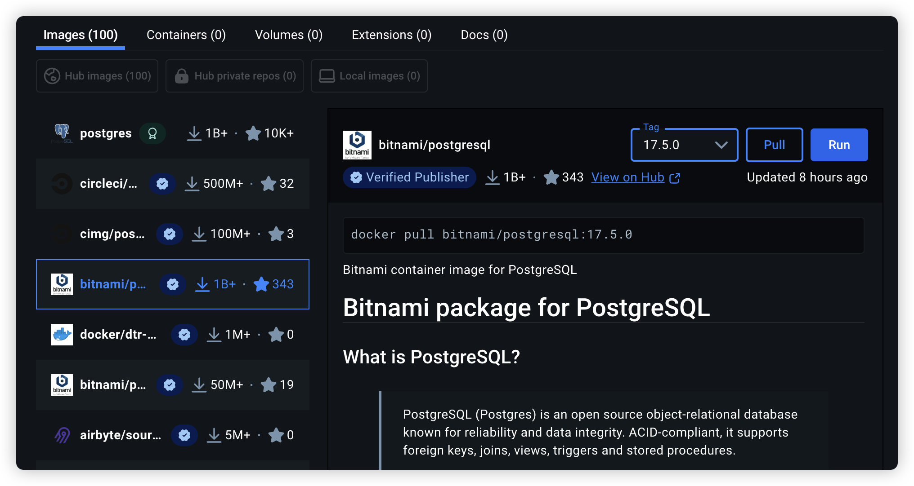
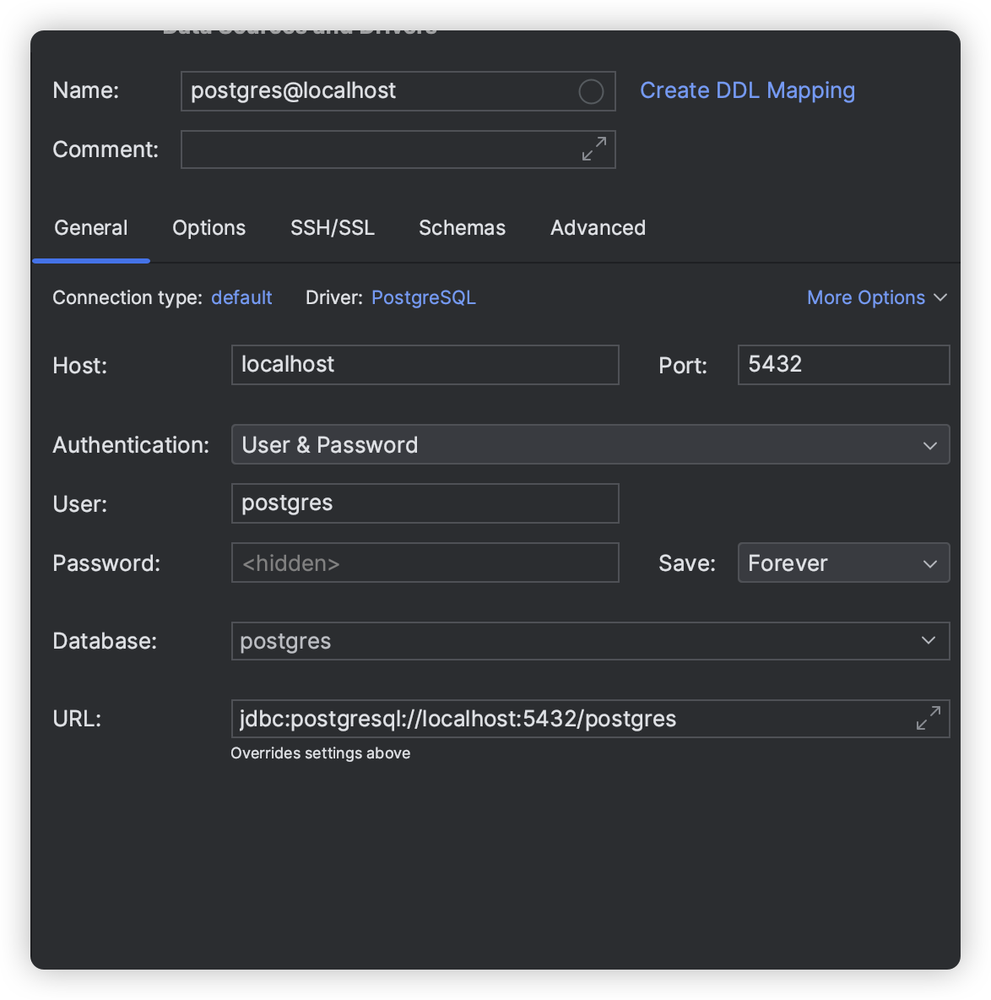
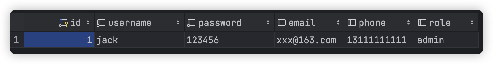
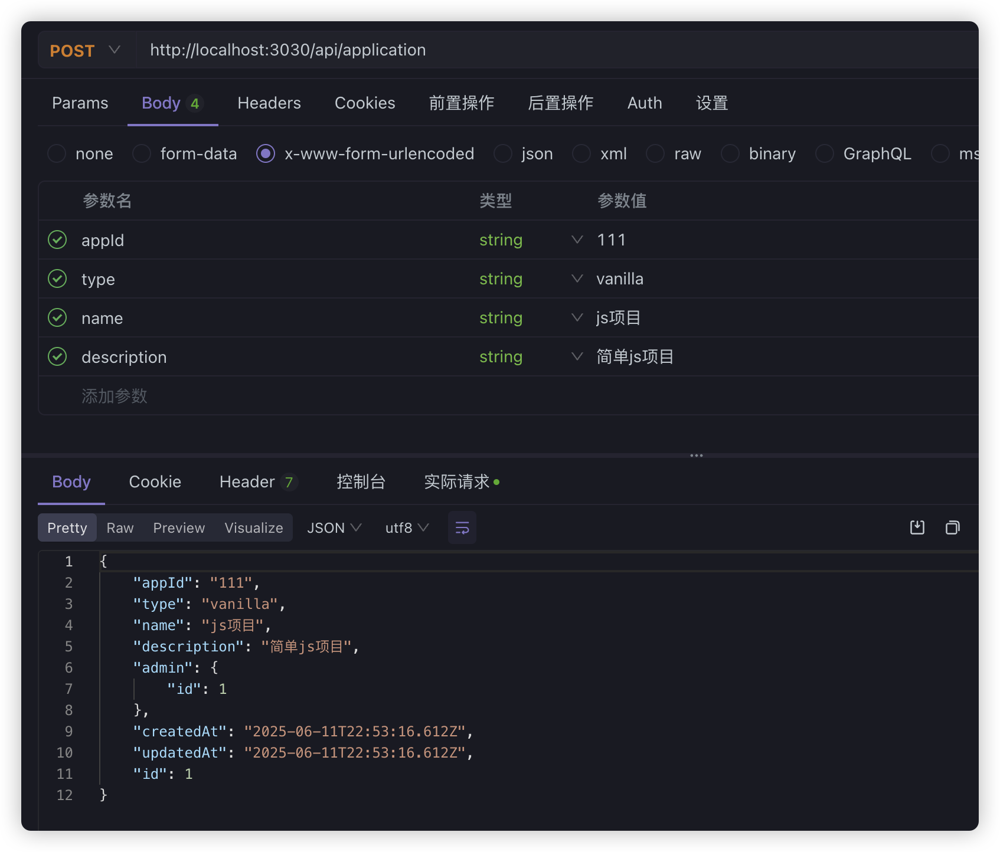
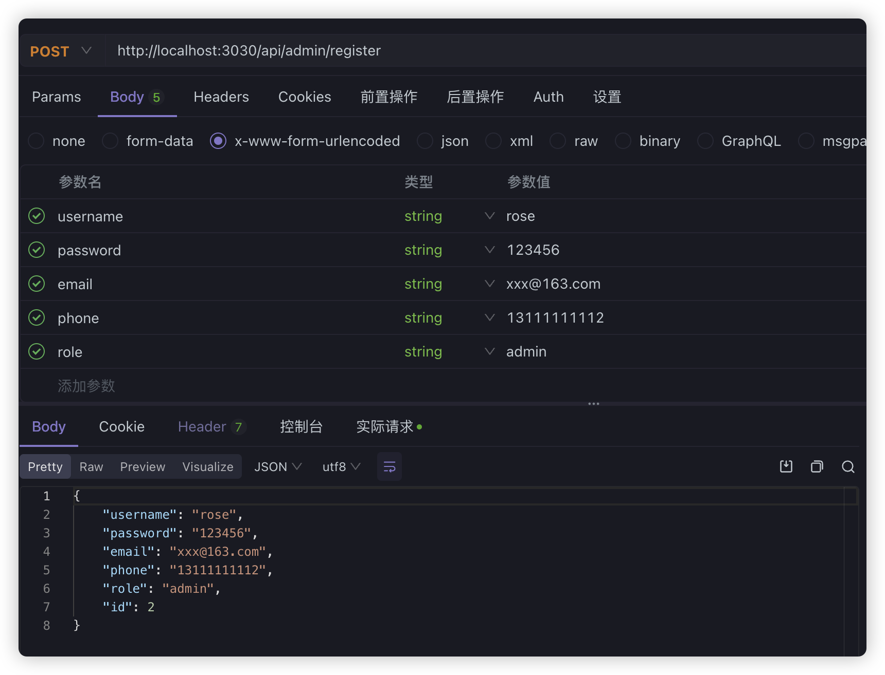
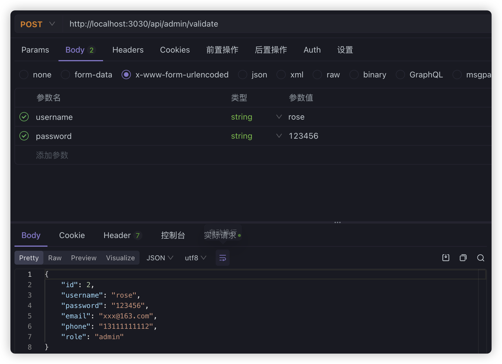
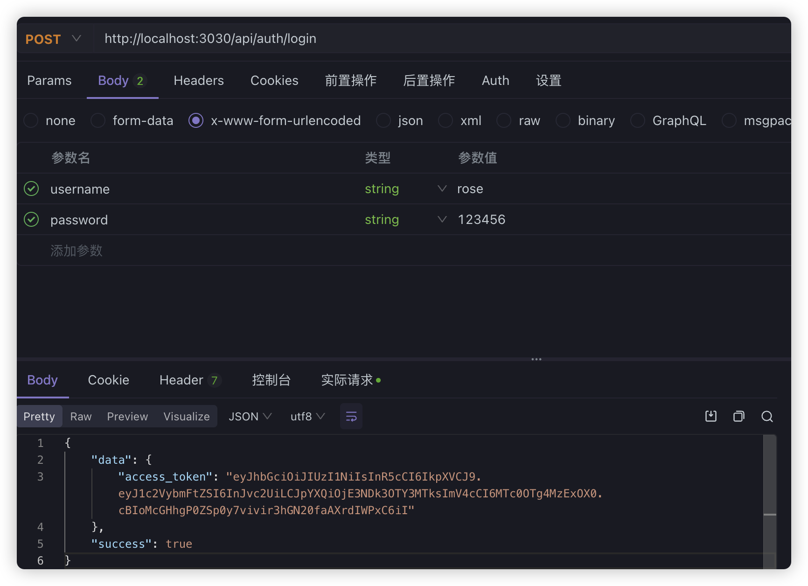
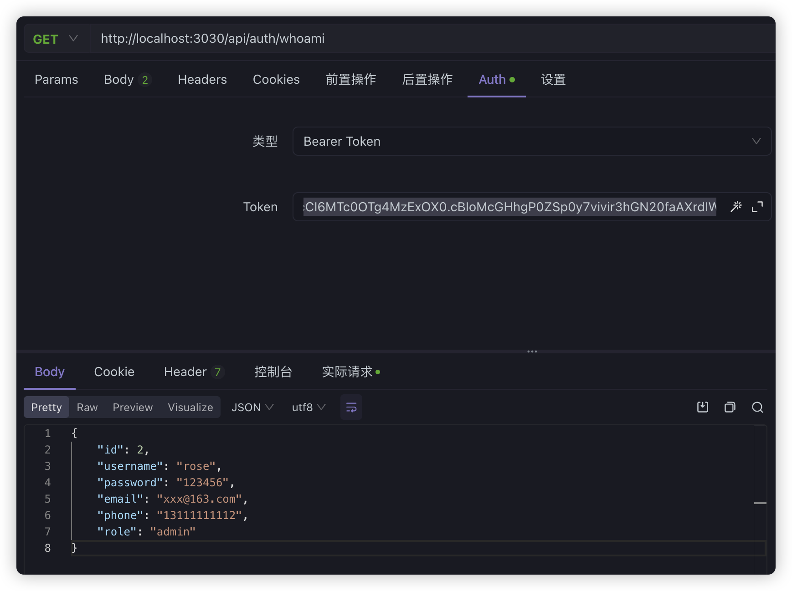

## monitor平台后端项目基础构建

### PostgreSQL

PostgreSQL（简称 Postgres）是一个**开源的关系型数据库管理系统（RDBMS）**。它以**功能强大、扩展性好、标准兼容性高**而著称，是业界认可的**企业级数据库系统**之一。

我们当然还是在docker中安装它，我们还是选择binami的版本，毕竟binami版本更偏向企业级部署和 DevOps 场景



我们还是在服务编排中加入PostgreSQL的配置

```typescript
version: "3"

services:
  duyi-monitor-clickhouse-2:
    image: bitnami/clickhouse:25.5.2
    container_name: duyi-monitor-clickhouse-2
    ports:
      - "8123:8123"
      - "9000:9000"
    environment:
      - CLICKHOUSE_USER=default
      - CLICKHOUSE_PASSWORD=123456
      - CLICKHOUSE_DATABASE=default
  duyi-monitor-postgres:
    image: bitnami/postgresql:17.5.0
    container_name: duyi-monitor-postgres
    ports:
        - 5432:5432
    environment:
        - POSTGRESQL_USERNAME=postgres
        - POSTGRESQL_PASSWORD=123456
        - POSTGRESQL_DATABASE=postgres
    volumes:
        - ./postgresql_data:/bitnami/postgresql
networks:
    default:
      name: duyi-monitor-network
      driver: bridge
```

同样运行之前定义的命令脚本`pnpm run docker:start`下载相关image，并且启动container即可，然后我们就可以在GUI工具中进行连接



然后，在`apps/backend`目录下创建监控平台对应的api后端项目

```shell
nest n monitor-server -g -p pnpm
```

然后，一些不需要的内容，比如eslint等等，同样我们可以删除掉。

由于我们要进行一些增删改查的CRUD操作，所以我们可以使用`TypeORM`关系对象映射相关的处理，引入相关的包，这些内容在Nest.js相关视频中都有详细的讲解。我们就直接在`monitor-server`项目目录下，引入相关的包

```typescript
pnpm add typeorm @nestjs/typeorm pg
```

然后在全局入口`app.module.ts`中引入`TypeORM`

```typescript
@Module({
  imports: [
    TypeOrmModule.forRoot({
      type: "postgres",
      host: "localhost",
      username: "postgres",
      port: 5432,
      password: "123456",
      database: "postgres",
      entities: [__dirname + "/**/*.entity{.ts,.js}"],
      synchronize: true
    })
  ],
  controllers: [AppController],
  providers: [AppService]
})
```

然后使用命令：

```shell
 nest g res application --no-spec
 nest g res admin --no-spec
```

帮我们生成`application`和`admin`相关实体，模块和CRUD相关的API

我们可以在entity中加入相关的属性，对应生成数据库中的table表

**admin.entity.ts**

```typescript
import { Application } from "../../application/entities/application.entity";
import { Entity, PrimaryGeneratedColumn, Column, OneToMany } from "typeorm";

@Entity()
export class Admin {
  @PrimaryGeneratedColumn()
  id: number;

  @Column()
  username: string;

  @Column()
  password: string;

  @Column({ nullable: true })
  email: string;

  @Column({ nullable: true })
  phone: string;

  @Column({ nullable: true })
  role: string;

  @OneToMany(() => Application, application => application.admin, {
    cascade: true
  })
  applications: Application[];
}

```

**application.entity.ts**

```typescript
import { Admin } from "../../admin/entities/admin.entity";
import { Column, Entity, JoinColumn, ManyToOne, PrimaryGeneratedColumn } from "typeorm";

@Entity()
export class Application {
  constructor(partial: Partial<Application>) {
    Object.assign(this, partial);
  }
  /**
   * 主键
   */
  @PrimaryGeneratedColumn()
  id: number;

  /**
   * 项目ID
   */
  @Column({ type: "varchar", length: 80, name: "app_id" })
  appId: string;

  /**
   * 项目类型
   */
  @Column({ type: "enum", enum: ["vanilla", "react", "vue"] })
  type: "vanilla" | "react" | "vue";

  /**
   * 项目名称
   */
  @Column({ type: "varchar", length: 255 })
  name: string;

  /**
   * 项目描述
   */
  @Column({ type: "text", nullable: true })
  description?: string;

  /**
   * 项目创建时间
   */
  @Column({ nullable: true, default: () => "CURRENT_TIMESTAMP", name: "created_at" })
  createdAt?: Date;

  /**
   * 项目更新时间
   */
  @Column({ nullable: true, default: () => "CURRENT_TIMESTAMP", name: "updated_at" })
  updatedAt?: Date;

  @ManyToOne(() => Admin, admin => admin.applications)
  @JoinColumn({
    name: "admin_id",
    referencedColumnName: "id",
    foreignKeyConstraintName: "FK_application_admin"
  })
  admin: Admin;
}

```

无论如何，我们运行命令`pnpm start:dev`启动一下当前的项目，通过TypeORM相关的表就能帮我们创建到`Postgres`数据库中

然后测试一下创建和查询的功能，因为表有关联，所以先直接在数据库中添加一条管理员数据



application应用数据，我们就用代码创建。为了简单，数据验证，dto这些处理，我这里就略过了，直接通过界面传递的@Body数据来创建application数据，用户id也直接简单模拟id=1的用户

**application.controller.ts**

```typescript
@Post()
create(@Body() body) {
  const admin = new Admin();
  admin.id = 1; // 测试数据，后面从界面中获取用户相关信息
  const application = new Application(body);
  application.admin = admin; // 关联管理员
  return this.applicationService.create(application);
}
```

**application.service.ts**

```typescript
@Injectable()
export class ApplicationService {
  constructor(
    @InjectRepository(Application)
    private readonly applicationRepository: Repository<Application>
  ) {}

  async create(application) {
    await this.applicationRepository.save(application);
    return application;
  }
}
```

由于需要用到`Repository`，所以在module中我们需要注入

```typescript
@Module({
  imports: [TypeOrmModule.forFeature([Application])],
  controllers: [ApplicationController],
  providers: [ApplicationService]
})
export class ApplicationModule {}
```

为了体现这是后端api相关接口的处理，我们也可以**全局加上api前缀**，在main.ts中处理，并且改一下可能产生冲突的**端口号**

```typescript
async function bootstrap() {
  const app = await NestFactory.create(AppModule);
  app.setGlobalPrefix("api");
  app.enableCors(); // 解决跨域问题
  await app.listen(process.env.PORT ?? 3030);
}
bootstrap();
```

这样，我们就可以直接使用**apifox**来测试一下



### 登录鉴权

引入相关包：

```typescript
pnpm add @nestjs/passport passport passport-local passport-jwt @nestjs/jwt -S
pnpm add @types/passport-local @types/passport-jwt -D 
```

首先还是直接全局配置JWT，在AppMoudle中配置一下：

```typescript
@Module({
  imports: [
    JwtModule.register({
      global: true,
      secret: "MySecret",
      signOptions: { expiresIn: "1d" }
    }),
    ......
  ],
  controllers: [AppController],
  providers: [AppService]
})
```

**global:true**设置为全局，这样不用在其他模块每次都引用。

创建auth模块，专门来处理鉴权问题

```shell
nest g mo auth
nest g co auth --no-spec
nest g s auth --no-spec
```

当然，auth中的一些操作需要使用admin模块进行处理，我们先在adminService中处理相关的操作，比如用户注册和验证

**admin.service.ts**

```typescript
@Injectable()
export class AdminService {
  constructor(
    @InjectRepository(Admin)
    private readonly adminRepository: Repository<Admin>
  ) {}

  async validateUser(username: string, password: string): Promise<any> {
    const admin = await this.adminRepository.findOne({
      where: { username, password }
    });
    return admin;
  }

  async create(admin) {
    await this.adminRepository.save(admin);
    return admin;
  }
  // ......省略
}
```

当然，要使用`Repository`，还是需要在module中import进来

**admin.module.ts**

```typescript
@Module({
  imports: [TypeOrmModule.forFeature([Admin])],
  controllers: [AdminController],
  providers: [AdminService],
  exports: [AdminService]
})
export class AdminModule {}
```

> **注意：**`admin.service.ts`需要导出，方便我们在`auth`模块中使用，所以，在admin.module.ts中进行导出

可以使用`admin.controller.ts`简单测试一下

```typescript
@Controller("admin")
export class AdminController {
  constructor(private readonly adminService: AdminService) {}

  @Post("/register")
  create(@Body() body) {
    const res = this.adminService.create(body);
    return res;
  }

  @Post("/validate")
  async validate(@Body() body) {
    return this.adminService.validateUser(body.username, body.password);
  }
  
  // ......
}
```

使用apifox简单测试一下：





接下来就是auth模块相关的处理，现在**`auth.service.ts`**中处理相关登录验证业务，这需要用到adminService，所以在module中记得先引入

```typescript
@Module({
  imports: [AdminModule],
  providers: [AuthService],
  controllers: [AuthController]
})
export class AuthModule {}
```

**auth.service.ts**

```typescript
import { Injectable } from "@nestjs/common";
import { JwtService } from "@nestjs/jwt";
import { AdminService } from "src/admin/admin.service";

@Injectable()
export class AuthService {
  constructor(
    private readonly jwtService: JwtService,
    private readonly adminService: AdminService
  ) {}

  async validateUser(username: string, pass: string): Promise<any> {
    const admin = await this.adminService.validateUser(username, pass);
    if (admin) {
      // 从 admin 对象中移除密码字段
      const { password, ...result } = admin;
      return result;
    }
    return null;
  }

  async login(user: any) {
    const payload = {
      username: user.username,
      sub: user.userId
    };

    return {
      access_token: this.jwtService.sign(payload)
    };
  }
}

```

然后需要controller进行处理，而且在处理的时候我们需要进行拦截，一个是登录的时候本地处理，还有就是访问其他需要权限接口时候jwt的处理，由于我们使用了passport相关的包，我们可以分别创建不同的策略进行处理

**local.strategy.ts**

```typescript
import { Injectable, HttpException, UnauthorizedException } from "@nestjs/common";
import { PassportStrategy } from "@nestjs/passport";
import { Strategy } from "passport-local";
import { AuthService } from "./auth.service";

@Injectable()
export class LocalStrategy extends PassportStrategy(Strategy) {
  constructor(private readonly authService: AuthService) {
    super();
  }

  async validate(username: string, password: string): Promise<any> {
    const user = await this.authService.validateUser(username, password);
    if (!user) {
      throw new UnauthorizedException();
    }
    return user;
  }
}


```

> 注意：`PassportStrategy(Strategy)`这里引入的**Strategy**是`passport-local`包下的

**jwt.strategy.ts**

```typescript
import { Injectable } from "@nestjs/common";
import { PassportStrategy } from "@nestjs/passport";
import { ExtractJwt, Strategy } from "passport-jwt";
import { AdminService } from "src/admin/admin.service";

@Injectable()
export class JwtStrategy extends PassportStrategy(Strategy) {
  constructor(private readonly adminService: AdminService) {
    super({
      // 表示从header中的Authorization属性中获取Bearer的token值
      jwtFromRequest: ExtractJwt.fromAuthHeaderAsBearerToken(),
      // 表示不忽视token过期的情况，过期会返回401
      ignoreExpiration: false,
      secretOrKey: "MySecret"
    });
  }

  async validate(payload: any) {
    const user = await this.adminService.validateUser(payload.username, payload.password);
    return user;
  }
}

```

> 注意：`PassportStrategy(Strategy)`这里引入的**Strategy**是`passport-jwt`包下的

有了这两个文件之后，要在controller中使用还需要在module中引入

```typescript
@Module({
  imports: [AdminModule, PassportModule],
  providers: [AuthService, LocalStrategy, JwtStrategy],
  controllers: [AuthController]
})
export class AuthModule {}
```

**auth.controller.ts**

```typescript
import { Body, Controller, Get, Post, UseGuards, Request } from "@nestjs/common";
import { AuthGuard } from "@nestjs/passport";
import { AuthService } from "./auth.service";

@Controller("auth")
export class AuthController {
  constructor(private readonly authService: AuthService) {}

  @Post("/login")
  @UseGuards(AuthGuard("local"))
  async login(@Body() body) {
    const data = await this.authService.login(body);
    return {
      data,
      success: true
    };
  }

  @Get("/whoami")
  // 必须要登录之后，具备用户身份才能访问，我们需要用守卫来做鉴权，并且鉴权策略是 jwt
  @UseGuards(AuthGuard("jwt"))
  async whoami(@Request() req) {
    return req.user;
  }

  @Get("/validate")
  async validate(@Body() body) {
    return this.authService.validateUser(body.username, body.password);
  }
}

```

这样，使用apifox进行相关测试：




